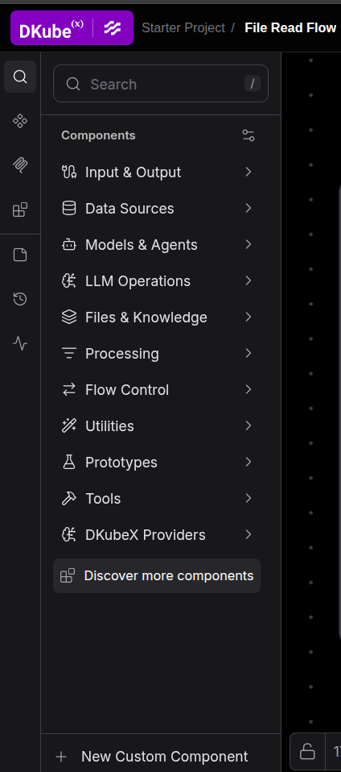

# Components

Components are the building blocks of a flow. Langflow ships with a wide catalog covering inputs, models, memory, retrieval, tools, and outputs. On DKubeX, the **SecureLLM** model provider connects Langflow's model components to the cluster-local SecureLLM service.

## Categories

| Category | What's inside |
|----------|--------------|
| **Input & Output** | Chat input, text input, file loaders, chat output, text output |
| **Data Sources** | Database connectors, API request components, web scrapers |    
| **Models & Agents** | OpenAI, Anthropic, Mistral, Ollama, Hugging Face, and more |
| **LLM Operations** | Prompt templates, chains, and LLM utility components |
| **Files & Knowledge** | File loaders, document parsers, knowledge base connectors |
| **Processing** | Text splitters, parsers, transformers |
| **Flow Control** | Conditional routers, loops, and parallel execution |
| **Utilities** | Python REPL, custom tools, web search |
| **Prototypes** | Experimental components |
| **Tools** | Agents with tool-calling capabilities |

## SecureLLM Models

On DKubeX, language and embedding models come from the **SecureLLM** service running in the same cluster. Use them through Langflow's standard model components:

| Component | Category | Use it for |
|-----------|----------|------------|
| **Language Model** | Models & Agents | Chat and text generation (also the model used by **Agent**) |
| **Embedding Model** | Models & Agents | Vector embeddings for Vector Store, Knowledge Base and retrieval flows |

**Your API key is configured automatically.** When you open Langflow, your SecureLLM key is fetched from your DKubeX account and stored as the `SECURELLM_API_KEY` global variable. It is shown as *Managed by DKubeX* and cannot be edited or removed — you never need to enter it.

**How to use:**

1. Open **Settings → Model Providers → SecureLLM** and turn on the models you want to use (the first few are enabled by default). Only the models configured by your administrator in SecureLLM are listed.
2. Drop a **Language Model** or **Embedding Model** component onto the canvas.
3. In the component's model selector, pick a SecureLLM model — chat models appear in **Language Model**, embedding models in **Embedding Model**.
4. Connect the component to your flow.

> **Note:** If a model you expect is missing, enable it under **Settings → Model Providers → SecureLLM**. If SecureLLM lists no embedding models, ask your cluster administrator to add one in SecureLLM.

## Configuring Any Component

1. Fill in required fields (marked with `*`).
2. Use the **Code** tab to view or customize the underlying Python code.
3. Click a component on the canvas to open its side panel, containing the advanced options.

## Custom Components

You can create your own component by either modifying the code of an existing component, or by clicking on **New Custom Component** to build a custom component from scratch.
