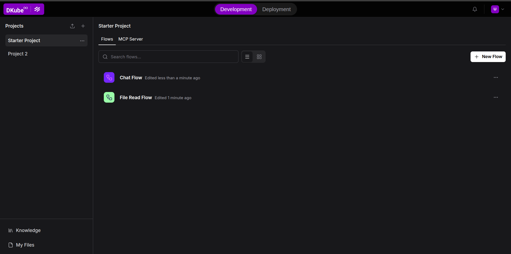
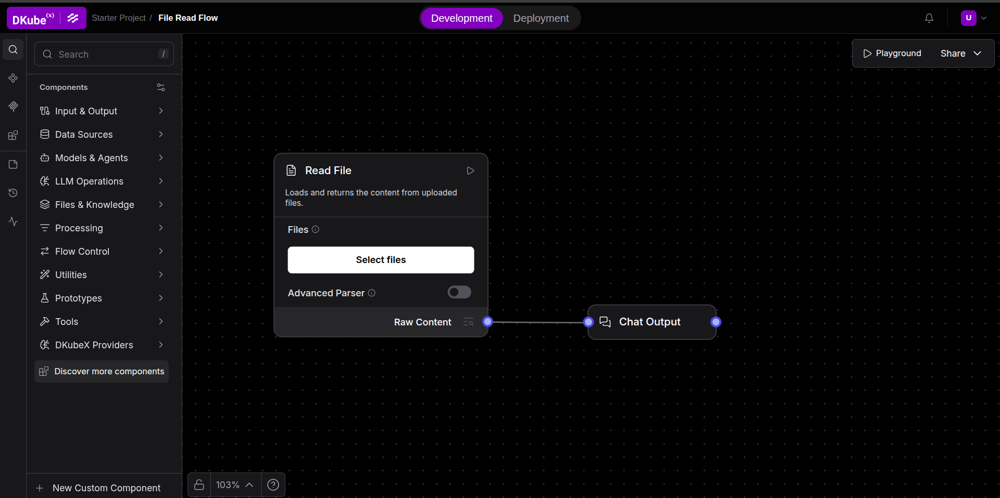

# Getting Started

Langflow is a visual workflow builder for AI-powered agents and pipelines. On DKubeX, it comes pre-configured with platform authentication, a built-in deployment system, and DKubeX-native LLM and Embedding components backed by **SecureLLM**.

## Prerequisites

- Access to a DKubeX environment with Langflow enabled.
- A modern browser (Chrome, Firefox, Safari, or Edge).

## Launching Langflow

1. Click the **Langflow** tile in your DKubeX dashboard.
2. You are automatically logged in via DKubeX SSO — no separate Langflow credentials are needed.
3. The Langflow canvas loads with the DKubeX header pinned to the top.

## The DKubeX Header

The header at the top of every page provides:

- **DKubeX logo** — links back to the platform dashboard.
- **Development / Deployment tab switcher** — switch between developing flows and managing deployed workflows.
- **Flow breadcrumb** — shown when editing a flow; displays the folder and flow name with an edit shortcut.
- **Notifications button**

## Creating Your First Flow

1. Click **New Flow** from the projects list.
2. Choose a blank canvas or a starter template.
3. Drag components from the left sidebar onto the canvas.
4. Connect component outputs to inputs by dragging between the colored ports.
5. Click the **Play** button on any component to run the flow up to that point.
6. For workflows involving chat components, you can click on the **Playground** button on the top left corner of the canvas to test the workflow by providing inputs and/or receiving the flow output.

## Using SecureLLM Models

DKubeX connects Langflow to the cluster-local **SecureLLM** service. Your SecureLLM API key is set up automatically from your DKubeX account the first time you open Langflow — there is nothing to enter.

1. Open **Settings → Model Providers → SecureLLM** and enable the models you want.
2. Drop a **Language Model** (chat) or **Embedding Model** component onto the canvas.
3. Select a SecureLLM model in the component and wire it into your flow.

See [Components](./components.md#securellm-models) for details.

## Next Steps

- Learn [canvas basics and flow authoring](./building-flows.md).
- Browse the full [component catalog](./components.md).
- When ready, [deploy your flow](./deploying-flows.md) as a standalone API endpoint.
