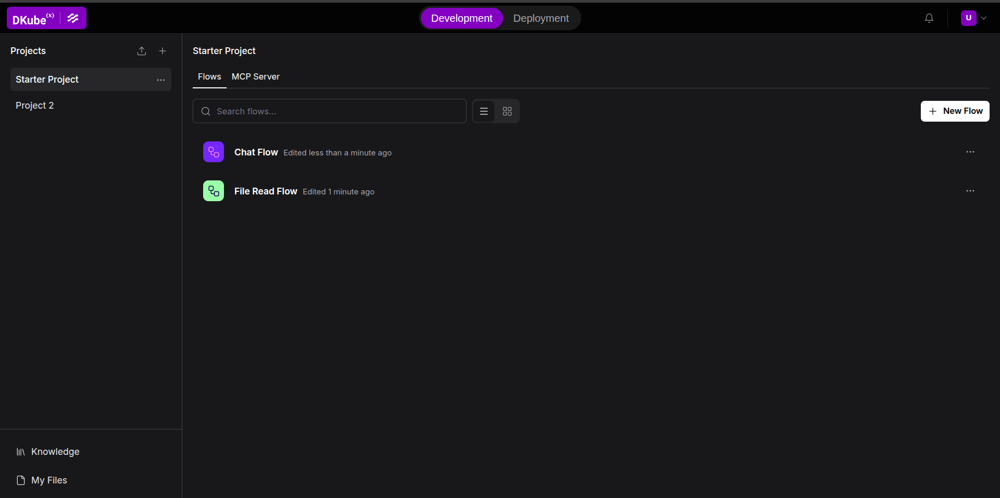

# Langflow

Langflow on DKubeX is a visual AI workflow builder integrated directly into the DKubeX platform. It lets you design, run, and deploy AI pipelines — from simple LLM chains to multi-step retrieval-augmented generation (RAG) systems — using a drag-and-drop canvas, without writing boilerplate code. On DKubeX, Langflow comes pre-configured with single sign-on, cluster-local LLM and embedding models via **SecureLLM**, and a built-in one-click deployment system that promotes any flow into a persistent API endpoint.



## Key features

- **Visual canvas** — Build flows by connecting components with typed ports. No boilerplate required.
- **DKubeX Providers** — Drop-in LLM and embedding components backed by the cluster-local SecureLLM service. No external API keys needed.
- **One-click deployment** — Promote any flow to a standalone Kubernetes pod with its own internal API endpoint.
- **Platform SSO** — Automatically authenticated via DKubeX. No separate Langflow login.
- **Global variables** — Store and encrypt secrets once; reference them from any component in any flow.
- **Version history** — Every save is a revision. Roll back to any previous version at any time.
- **Theme sync** — Follows your DKubeX platform theme (light, dark, or system).

## Tutorials

- [Getting started](./getting-started.md) — Launch Langflow, build your first flow, and use DKubeX LLM components.
- [Building flows](./building-flows.md) — Canvas navigation, component configuration, variables, and version control.
- [Components](./components.md) — Component catalog overview, DKubeX Providers (LLM and Embeddings), and custom components.
- [Deploying flows](./deploying-flows.md) — Promote a flow to a standalone API endpoint and manage deployments.

```{toctree}
:hidden:

getting-started
building-flows
components
deploying-flows
```
