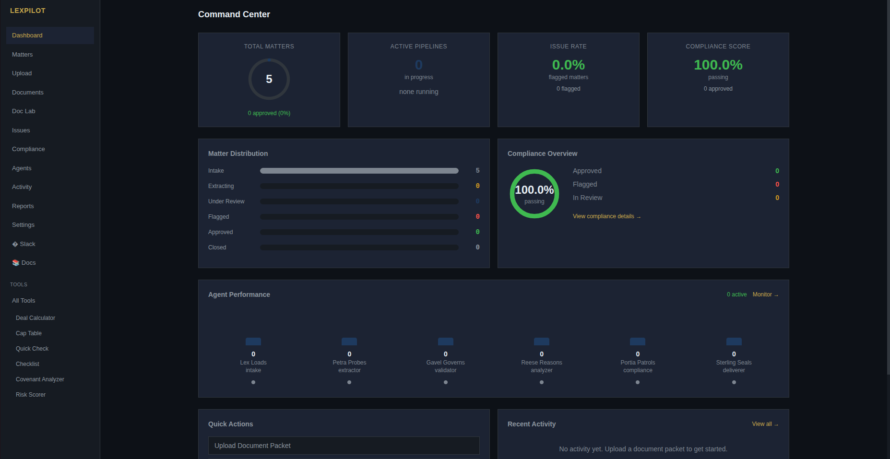

# LexPilot

LexPilot is an AI-powered legal document analysis platform that automates contract review, compliance checking, and risk analysis for corporate and securities transactions. It processes entire deal packages through a multi-agent pipeline — classifying documents, extracting structured fields, validating consistency, analyzing contracts, and checking regulatory compliance — turning hours of manual review into minutes.



## Key features

- **Intelligent document processing** — automatic classification, OCR, and structured field extraction from term sheets, purchase agreements, board resolutions, and more.
- **Multi-agent pipeline** — specialized agents (Lex, Petra, Gavel, Reese, Portia) handle intake, extraction, validation, contract analysis, and compliance in sequence.
- **Compliance engine** — 50+ regulatory rules across California, Delaware, and federal securities law, scored per matter.
- **Deterministic validation** — catches entity-name mismatches, amount inconsistencies, date conflicts, and missing required documents.
- **Automated reporting** — comprehensive PDF deal reports with findings, recommendations, and a complete audit trail.
- **Real-time notifications** — Telegram alerts for pipeline completion and critical issues.

## Tutorials

- [Overview](./overview.md) — what LexPilot is, why it exists, and a 5-minute quick start.
- [Features](./features.md) — a deep dive into document processing, the agent pipeline, and the compliance engine.
- [User guide](./user-guide.md) — step-by-step usage, from creating matters to generating reports.
- [Use cases & workflows](./use-cases.md) — transaction-specific walkthroughs for VC, M&A, formation, securities, and debt financing.
- [Comparison & ROI](./comparison.md) — how LexPilot compares to manual review and competing tools.
- [FAQ & troubleshooting](./faq.md) — answers to common questions on setup, accuracy, security, and performance.
- [Resources & support](./resources.md) — roadmap, version history, community, and support options.

```{toctree}
:hidden:

overview
features
user-guide
use-cases
comparison
faq
resources
```
