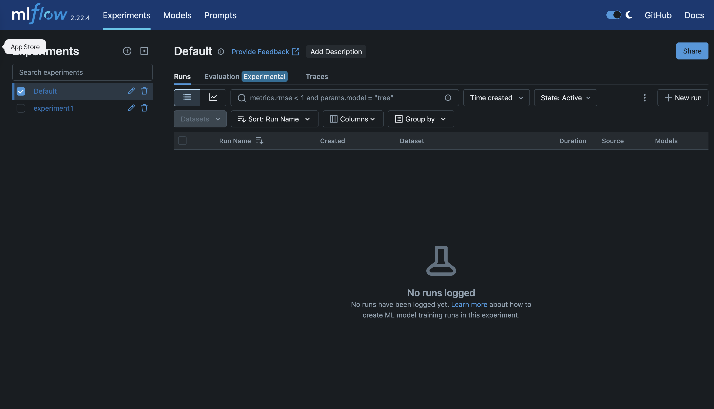

# MLflow

MLflow on DKubeX is a managed **MLflow Tracking Server** — experiment tracking, a model
registry, and artifact management, running in your cluster and reachable at `/mlflow`.
Point your training code at the in-cluster tracking endpoint and every run's parameters,
metrics, and artifacts are captured centrally; promote the best runs into the model
registry and deploy registered ML models straight from [ModelStudio](../modelstudio/index.md)
via KServe.



## Key features

- **Experiment tracking** — log parameters, metrics, tags, and artifacts for every run, grouped by experiment.
- **Run comparison** — compare runs side by side (metrics, params) to pick the best model.
- **Model registry** — register models, version them, and move versions through stages/aliases (Staging, Production, Archived).
- **Artifact storage** — models, plots, and files are stored in the platform's MinIO bucket, backed by a managed database for the tracking store.
- **MLflow UI** — the full upstream MLflow web UI, served under `/mlflow` behind DKubeX single sign-on.
- **ModelStudio integration** — deploy ML models (sklearn, XGBoost, PyTorch, …) directly from the MLflow registry through ModelStudio → KServe.

## Tutorials

- [Getting started](./getting-started.md) — open MLflow, point your code at it, and log your first run.
- [Core features](./user-features.md) — Experiments, Runs, Models, and Artifacts.
- [Workflows](./tutorials.md) — track a training run, register a model, and deploy it.

## At a glance

| Area | What you do |
|---|---|
| Experiments | Group and browse training runs |
| Runs | Inspect params, metrics, tags, and artifacts; compare runs |
| Models | Register, version, and stage models |
| Artifacts | Store/download models and files (MinIO-backed) |
| Integration | Deploy registered ML models via ModelStudio + KServe |

```{toctree}
:hidden:

getting-started
user-features
tutorials
```
