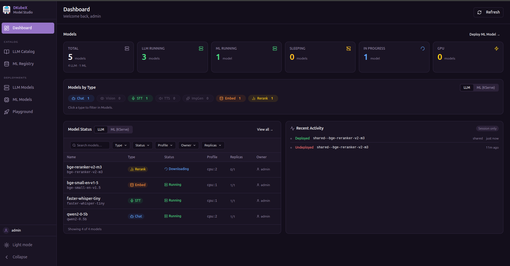
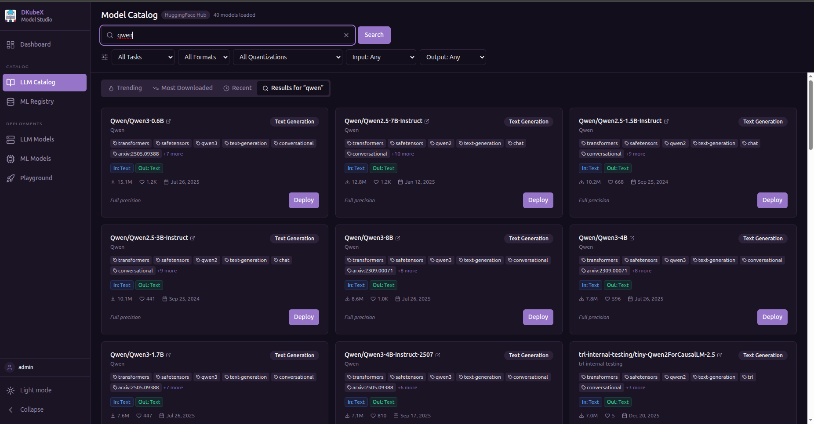
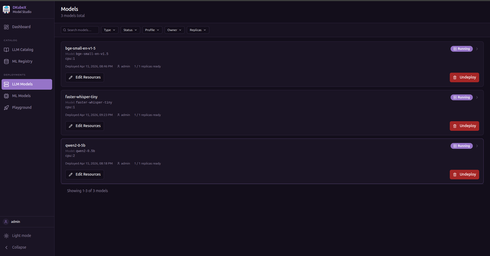

# Getting Started

ModelStudio is a web application for discovering, deploying, and running inference on AI models within the DKubeX platform. It supports three categories of models:

- **LLM models** — large language models deployed via [KubeAI](https://github.com/substratusai/kubeai), sourced from [HuggingFace Hub](https://huggingface.co)
- **ML models** — traditional machine learning models (sklearn, XGBoost, PyTorch, etc.) deployed via [KServe](https://kserve.github.io/website/), sourced from an [MLflow](https://mlflow.org) registry or HuggingFace Hub
- **NVIDIA NIM models** — production-optimized inference microservices from the NVIDIA NGC catalog, deployed in-cluster on GPU nodes via the k8s-nim-operator

## What You Can Do

- **LLM Catalog** — Search HuggingFace LLM models and deploy them with one click
- **LLM Models** — View, edit, promote, or delete your deployed LLM models
- **ML Registry** — Browse registered MLflow models or HuggingFace ML models and deploy them to KServe
- **ML Models** — View and delete your deployed KServe InferenceServices
- **NIM Catalog** — Discover NVIDIA NIM models and deploy them in-cluster on your GPU nodes
- **Resource Profiles** — Create and manage reusable CPU/memory/GPU configurations for model deployments
- **Settings** — Manage NGC API keys for NIM access
- **Run Inference** — Chat with models, upload documents for RAG, test vision/embeddings/reranking/image-gen/speech features
- **Track Activity** — See a log of all deploy/undeploy actions across your workspace

---

## Overview: The Pages

### Dashboard

The landing page shows a summary of your workspace:

- **Stats bar** — count of deployed models and recent activity
- **Models by Type** — breakdown of deployed capabilities (Chat, Embeddings, Reranking, TTS)
- **Model status table** — all deployed LLM models with their status, engine, features, scope, and resource profile; filterable by type, status, profile, owner, and replicas
- **ML models tab** — (visible when KServe is enabled) same view for deployed ML InferenceServices
- **Activity feed** — timestamped log of recent actions (deploys, deletes, scope changes)

---

### LLM Catalog

Search HuggingFace and deploy LLM models directly.

**Tabs:**
- **Trending** — models gaining momentum on HuggingFace
- **Most Downloaded** — sorted by all-time download count
- **Recent** — newest models
- **Search Results** — results for your search query or HuggingFace URL/slug

**Filters:**
| Filter | Options |
|--------|---------|
| Task | Text Generation, Embeddings, Reranking, Text to Speech *(Speech Recognition and Image Generation — coming in future KubeAI releases)* |
| Precision | GGUF, Safetensors, PyTorch |
| Quantization | Q4_K_M, Q4_0, Q5_K_M, Q6_K, Q8_0, FP16, BF16 |
| Input modality | Text, Image, Audio, Video, File |
| Output modality | Text, Image, Audio, Embeddings, Video |

Each model card shows downloads, likes, task type, and an estimated inference cost. Click **Deploy** to open the deployment form.

> **Note:** Filtering by modality or task for unsupported model types (Vision, Image Generation, STT) will show models in **LLM Catalog**, but KubeAI cannot yet serve them. Support is planned for future releases.

---

### LLM Models

A table of all LLM models you have deployed (private) plus any models promoted to shared.

**Columns:** Name · Engine · Status · Resource Profile · Replicas · Scope · Created At

**Actions per row:**
| Action | Description |
|--------|-------------|
| Edit | Change resource profile or replica count |
| Delete | Remove the model deployment |
| Promote / Demote | Move between private and shared scope |
| Open Playground | Jump straight to inference for this model |

Use the filter bar to narrow by type, status, profile, owner, or replicas.

---

### Playground

A unified inference workbench for testing your deployed LLM models.

**Currently supported model types in KubeAI:**

| Tab | Description |
|-----|-------------|
| **Chat** | Stream text responses from a deployed model |
| **RAG** | Upload documents (PDF, DOCX, TXT), retrieve relevant chunks, and ground chat responses |
| **Embeddings** | Generate vector embeddings for a piece of text |
| **Reranking** | Rerank a list of passages by relevance to a query |
| **Text to Speech** | Synthesize speech from text |

Token usage (prompt, completion, total) is shown after each response. Responses can be copied to the clipboard.

> **Coming in future KubeAI releases:** Vision (image + text), Image Generation, and Speech to Text will be supported once the corresponding KubeAI model types become available.

---

### ML Registry

Browse and deploy ML models (non-LLM). Only visible when KServe is enabled in the platform.

**Tabs:**
- **MLflow** — registered models from your MLflow model registry, including all versions and lifecycle stages (None, Staging, Production, Archived). Requires MLflow to be configured in the platform. All model formats (sklearn, XGBoost, LightGBM, TensorFlow, PyTorch, ONNX, MLflow pyfunc, HuggingFace) are deployable.
- **HuggingFace ML** — HuggingFace models filtered to ML task types. Only **text-based pipeline tasks** are supported by `kserve-huggingfaceserver`. Models with vision, audio, tabular, or multimodal pipeline tags show a **Coming Soon** badge and cannot be deployed until the runtime adds support.

Click **Deploy** on any supported model card to open the ML deploy form and create a KServe InferenceService.

---

### ML Models

A table of all your deployed KServe InferenceServices. Only visible when KServe is enabled.

**Filters:** format (sklearn, XGBoost, MLflow, HuggingFace, ONNX, PyTorch, TensorFlow), source, status, owner

**Actions:** view status, delete deployment

---

### Resource Profiles

Create, edit, and delete named resource configurations (CPU, memory, GPU, replicas) that can be loaded into the deploy forms as shortcuts.

> **Requires the database feature.** Resource Profiles are stored in the configured PostgreSQL database. If the database is not enabled, the page shows a banner with setup instructions.

Each profile captures:
- CPU request and optional limit
- Memory request and optional limit
- Optional GPU type and count
- Min and max replica counts

Once created, profiles appear in a **"Load from Profile"** dropdown at the top of both the LLM deploy modal and the ML deploy modal. Selecting a profile pre-fills the resource fields — fields remain editable after loading.

Profiles are workspace-wide: all users can see, load, edit, and delete any profile.

---

### Settings

Manage configuration for platform integrations. Currently contains **NGC API Keys** — the credentials needed to access the NVIDIA NGC catalog and inference APIs for NIM models.

- **Add a key** — paste your NGC Personal API Key; it is stored securely and only shown as a masked hint (`nvapi-****xxxx`)
- **Delete a key** — removes the saved credential; existing NIM registrations that reference it will stop working

> The Settings page is only visible when NIM is enabled in the platform.

---

## Next Steps

- [Workflows](./tutorials.md) — deploy your first LLM, ML, and NVIDIA NIM model, step by step
- [Deploying Models](./deploying-models.md) — advanced deployment options for both LLM and ML models
- [Playground Guide](./playground.md) — detailed walkthrough of each inference mode
