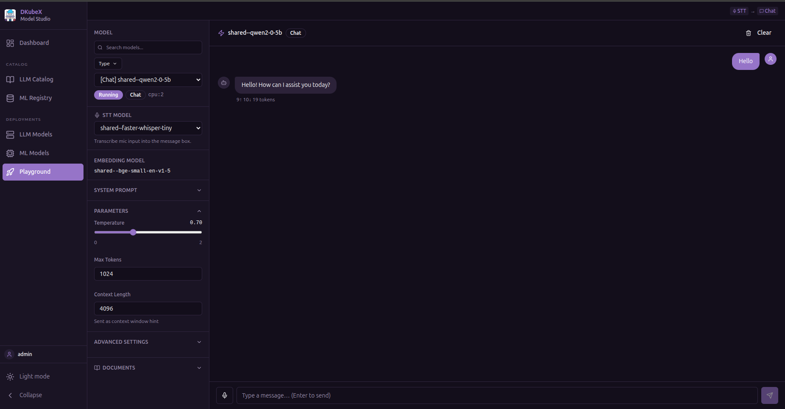
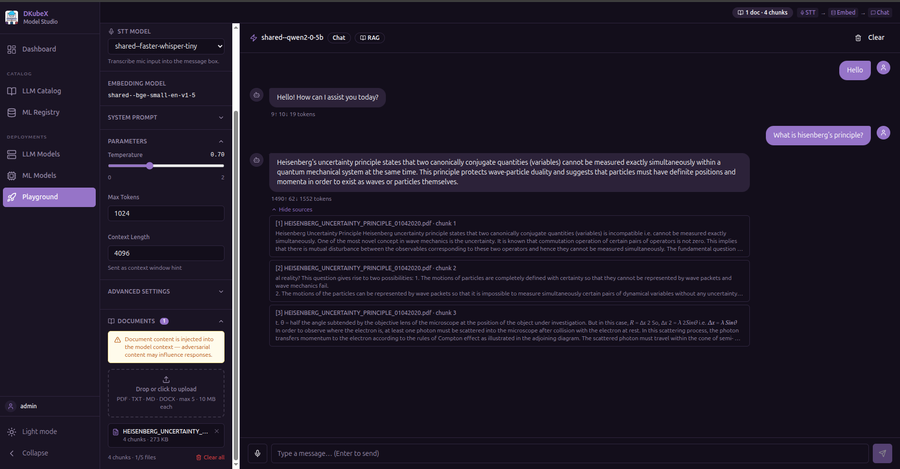
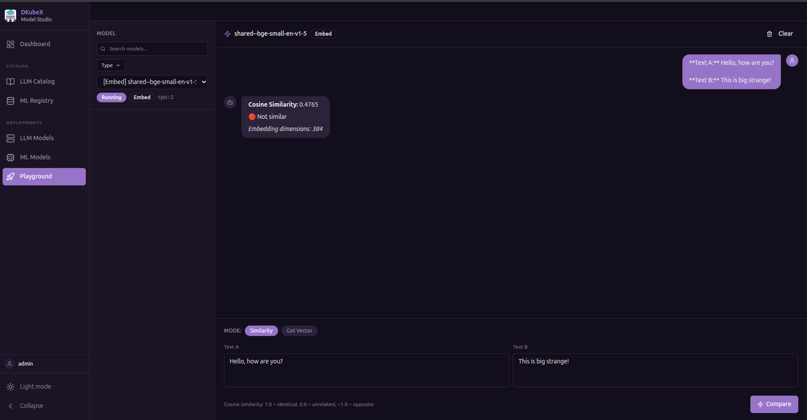

# Playground Guide

The **Playground** is a unified inference workbench where you can test your deployed LLM models and registered NVIDIA NIM models.

Select a model from the dropdown at the top, then choose a tab for the capability you want to test.

**Supported model types:**

| Tab | KubeAI LLM | NVIDIA NIM |
|-----|-----------|------------|
| Chat (Text Generation) | Yes | Yes (LLM models) |
| RAG (Document-Grounded Chat) | Yes | Yes (NIM LLM models) |
| Embeddings | Yes | Yes (NIM Embedding models) |
| Reranking | Yes | Yes (NIM Reranking models) |
| Text to Speech | Yes | — |
| Vision (Image + Text) | Coming in a future KubeAI release | Yes (NIM Vision-Language models) |
| Image Generation | Coming in a future KubeAI release | — |
| Speech to Text | Coming in a future KubeAI release | — |

> **Self-hosted NIM models that are still deploying:** A status banner appears above the input when a selected self-hosted NIM model is not yet Running. The input and Send button are disabled until the model becomes ready. The status updates automatically every 15 seconds.

---

## Chat (Text Generation)

Stream responses from a text-generation model.

- Type a message and press **Enter** or click **Send**
- Responses stream in real time
- Token usage (prompt / completion / total) is shown after each response
- Use the **Copy** button to copy the last response to clipboard
- **Clear** resets the conversation history

---

## RAG (Document-Grounded Chat)

Upload documents and have the model answer questions using content from them.

**Supported file types:** PDF, DOCX, TXT

**How it works:**
1. Upload one or more documents using the file picker
2. The app extracts text, splits it into chunks, and embeds each chunk using a deployed embedding model
3. When you send a message, the most relevant chunks are retrieved and injected into the model's context as grounding
4. The response includes **source attribution** — which document passages were used

> You need a deployed **embedding model** in addition to the text-generation model for RAG to work.

---

## Embeddings

Generate a vector embedding for a piece of text.

- Enter text in the input field and click **Generate**
- The embedding vector (array of floats) is displayed
- Useful for verifying that your embedding model is working correctly

---

## Reranking

Rerank a list of passages by relevance to a query.

- Enter a **query**
- Enter one passage per line in the **Documents** field
- Click **Rerank**
- Passages are returned sorted by relevance score (highest first)

---

## Text to Speech

Synthesize speech from text.

- Enter text in the input field
- Click **Synthesize**
- An audio player appears — click play to listen or download the audio file

---

## Coming in Future KubeAI Releases

The following tabs are present in the UI but require KubeAI model types that are not yet available. They will become functional once the corresponding KubeAI support ships.

### Vision (Image + Text)

Send images alongside text to vision-capable models.

- Click the **Attach Image** button to upload an image
- Type a question or instruction about the image
- The model receives both the image and text in the same message

### Image Generation

Generate images from a text prompt.

- Enter a text prompt describing the image
- Click **Generate**
- The generated image is displayed inline

### Speech to Text

Transcribe audio to text.

- Click **Record** to capture audio from your microphone, or upload an audio file
- Click **Transcribe**
- The transcription appears in the output panel

---

## Tips

- The model dropdown only shows models that match the selected tab's required features
- Token usage is tracked per request for all text-generation modes
- The Chat tab retains message history for multi-turn conversations; all other tabs are single-turn
