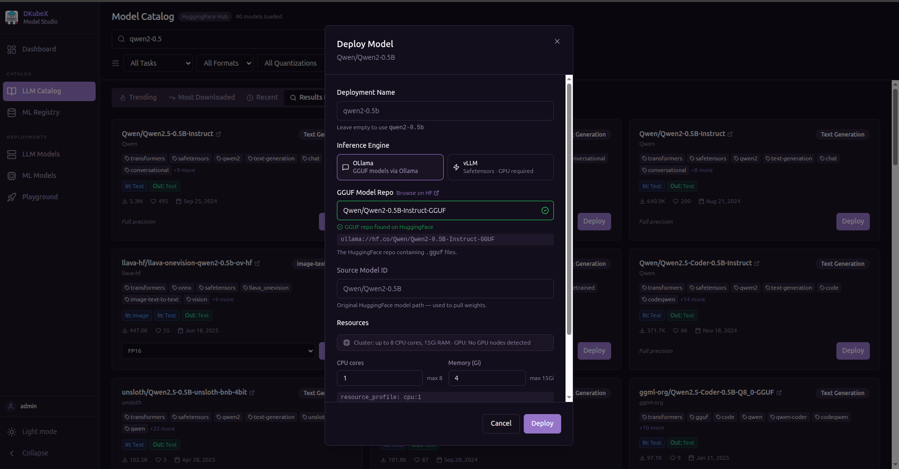

# Workflows

These end-to-end walkthroughs take you from the catalog to a running model for each of ModelStudio's three deployment tracks. For the full set of fields and options, see [Deploying Models](./deploying-models.md).

## Deploying Your First LLM Model

1. Go to the **LLM Catalog** page.
2. Search for a model (e.g. `qwen2`).
3. Click **Deploy** on a model card.
4. In the deploy form, choose:
   - **Quantization** (e.g. `Q4_K_M` for smaller footprint)
   - **Resource Profile** (CPU or GPU tier)
   - **Replicas** (number of serving instances)
   - **Scope** — `Private` (only you) or `Shared` (all workspace users)
5. Click **Deploy**.
6. The model appears in **LLM Models** with status `Pending`, then progresses to `Running`.

> **Tip:** Deploying takes a few minutes while the model image is pulled and pods start. Use the status column to track progress.

## Deploying Your First ML Model

1. Go to the **ML Registry** page.
2. Select the **MLflow** tab (or **HuggingFace ML** for HuggingFace-sourced models).
3. Click **Deploy** on a model.
4. In the ML deploy form, confirm or set the model format, resource requests, and replica counts.
5. Click **Deploy**.
6. The model appears in **ML Models** with status `Pending`, then transitions to `Running`.

## Your First NVIDIA NIM Model

> Requires an NGC Personal API Key. Get one at [org.ngc.nvidia.com/setup/personal-keys](https://org.ngc.nvidia.com/setup/personal-keys).

1. Go to **Settings → NGC API Keys** and click **Add Key**.
2. Paste your NGC Personal API Key and give it a name. The key is saved securely and shown only as a masked hint.
3. Go to the **Catalog** page and select the **NIM** tab.
4. Browse or search for a model (e.g. `llama`).
5. Click **Register** on a model card.
6. In the registration form, set GPU count and replicas (defaults are usually fine). Model weights are downloaded to cluster storage on first registration — expect 15–30 min for LLM models.
7. The NGC API Key you added in step 2 is used automatically for both NGC catalog metadata and the in-cluster image-pull secret.
8. Click **Register**.
9. The model appears in the model list and shows a status banner in the Playground while deploying. Once status is **Running**, the model is available for inference.
