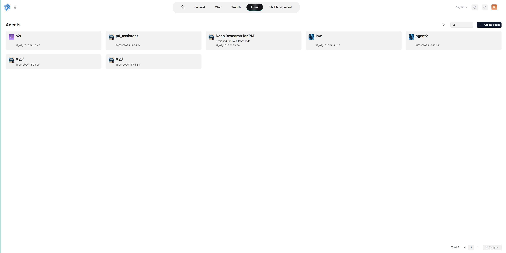
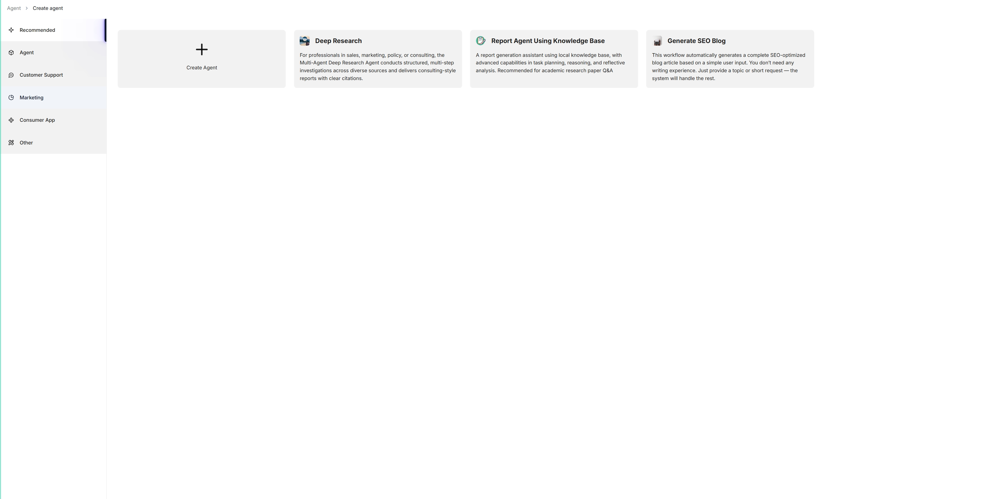
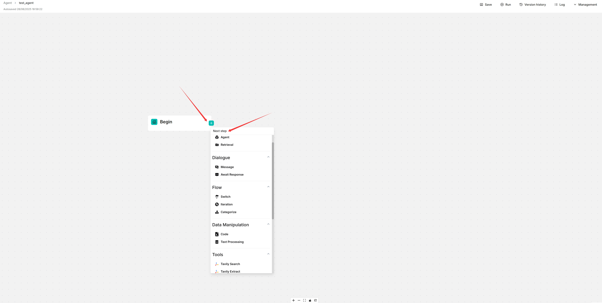
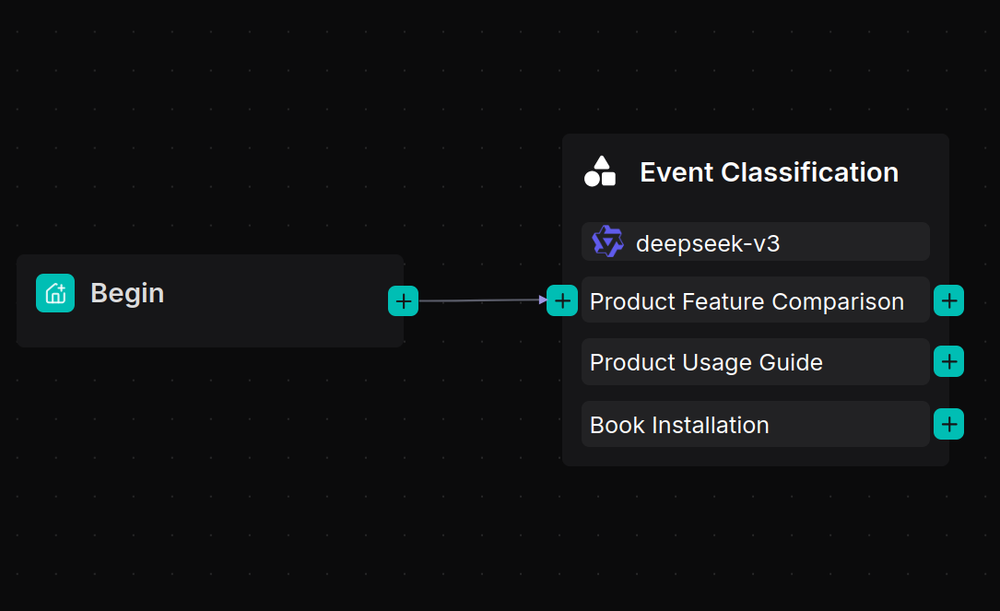
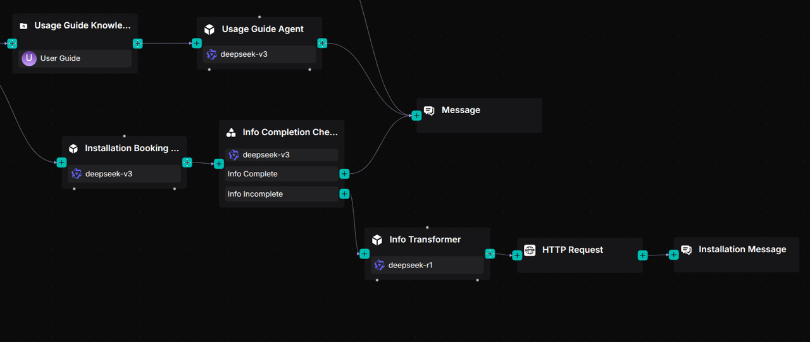
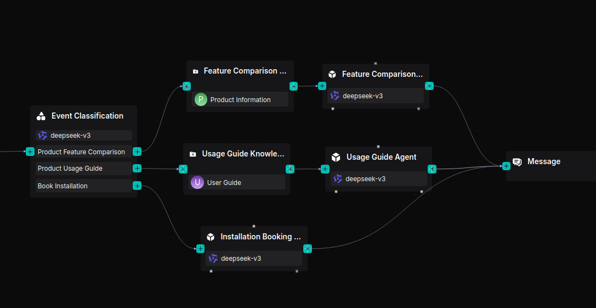

# Agents

Agents and RAG are complementary. On top of its RAG features, RAGFlow provides an **agent** mechanism — a no-code workflow editor on the front end and a graph-based task-orchestration framework on the back end. It lets you orchestrate techniques such as query intent classification, conversation leading, and query rewriting to handle more complex scenarios.

Before building an agent, make sure you have [set up your models](./models.md) and have a [dataset configured and parsed](./knowledge-bases.md).

## Create an agent

Click the **Agent** tab at the top of the page to open the **Agent** page. The cards there represent your existing agents.



RAGFlow also provides templates for different business scenarios. You can build from a template or from scratch:

1. Click **+ Create agent** to open the agent template page.

   

2. To start from scratch, click **Create Agent**. To use a template, click a card (e.g. **Deep Research**), name your agent, and click **OK**. You are taken to the no-code workflow editor.

   

3. Click the **+** button on the **Begin** component to add the components you want in your workflow.
4. Click **Save** to apply your changes.

> Agents can use a **Memory** module to accumulate context across interactions — configured through the agent's **Retrieval** and **Message** components. Memory can also be shared with your team (see [Team & sharing](./team-and-sharing.md)).

## Quickstart: an e-commerce customer support agent

This quickstart builds an agent that routes common customer requests — product comparisons, usage instructions, and installation bookings — to the right workflow.

**Prerequisites:** two datasets, **Product Information** and **User Guide**, with documents uploaded and parsed using the **Manual** chunking method.

### 1. Create the agent app

Navigate to the **Agent** page and create an agent app to enter the canvas. A **Begin** component appears. Configure a greeting in it, for example:

```
Hi! What can I do for you?
```

### 2. Add a Categorize component

The **Categorize** component uses an LLM to recognize user intent and route the conversation to the correct workflow.



### 3. Build a product feature comparison workflow


1. Add a **Retrieval** component named "Feature Comparison Knowledge Base" and connect it to the **Product Information** dataset.
2. Add an **Agent** component named "Feature Comparison Agent" after the Retrieval component.
3. Set its **System Prompt**:
   ```
   You are a product specification comparison assistant. Help the user compare products by confirming the models and presenting differences clearly in a structured format.
   ```
4. Set its **User Prompt**:
   ```
   User's query is /(Begin Input) sys.query
   Schema is /(Feature Comparison Knowledge Base) formalized_content
   ```

### 4. Build a product user guide workflow


1. Add a **Retrieval** component named "Usage Guide Knowledge Base" and link it to the **User Guide** dataset.
2. Add an **Agent** component named "Usage Guide Agent" with the System Prompt:
   ```
   You are a product usage guide assistant. Provide step-by-step instructions for setup, operation, and troubleshooting.
   ```
3. Set its User Prompt:
   ```
   User's query is /(Begin Input) sys.query
   Schema is /(Usage Guide Knowledge Base) formalized_content
   ```

### 5. Build an installation booking assistant



1. Add an **Agent** component named "Installation Booking Agent."
2. Configure its System Prompt to collect three details — contact number, preferred installation time, and installation address — then confirm them and notify the user that a technician will call.

### 6. Connect a Message component and run

Connect a **Message** component after the three agent branches to display the final response.



Click **Save** → **Run** and test the workflow with product comparison, usage guidance, and installation booking requests to verify each is routed and answered correctly.
