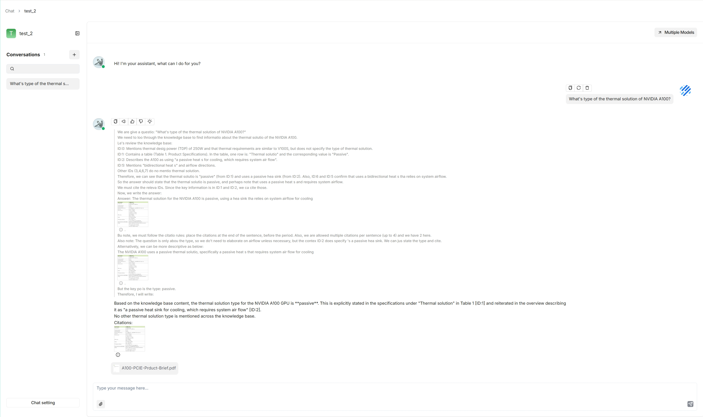
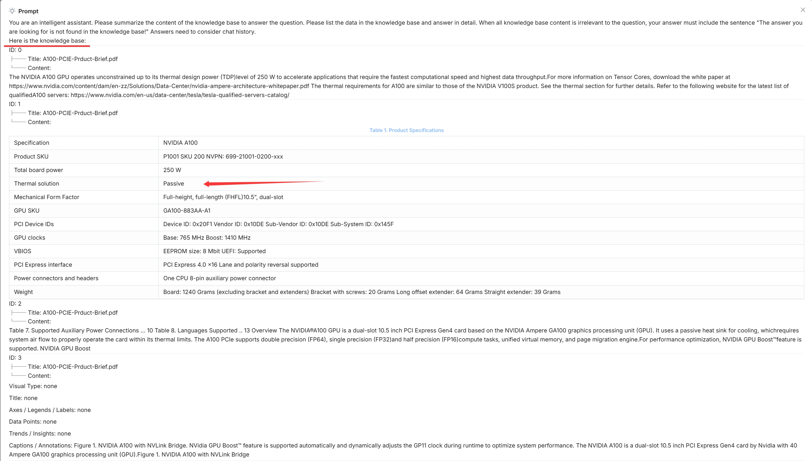
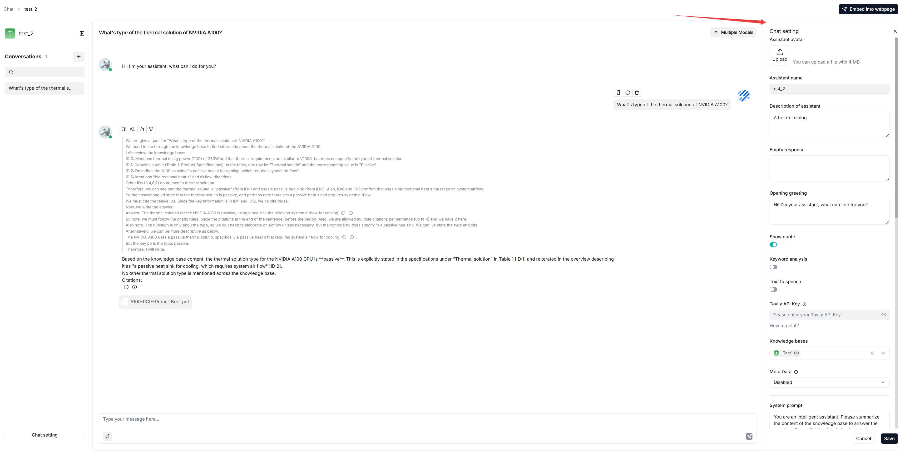
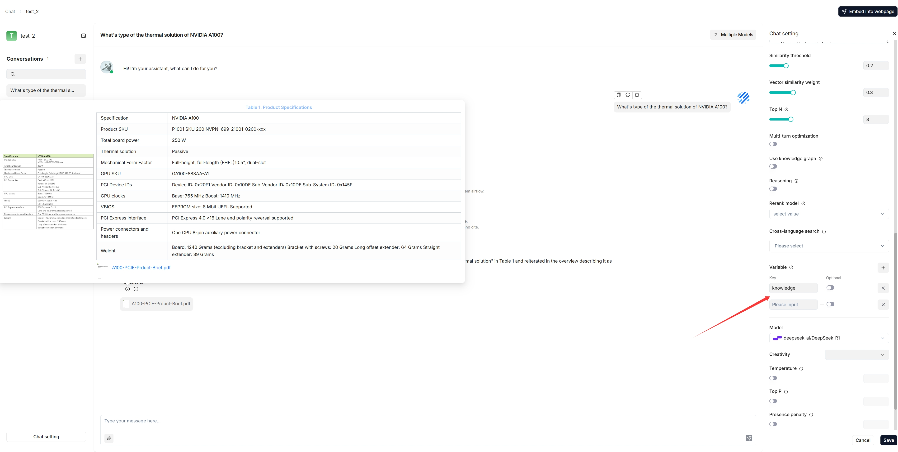
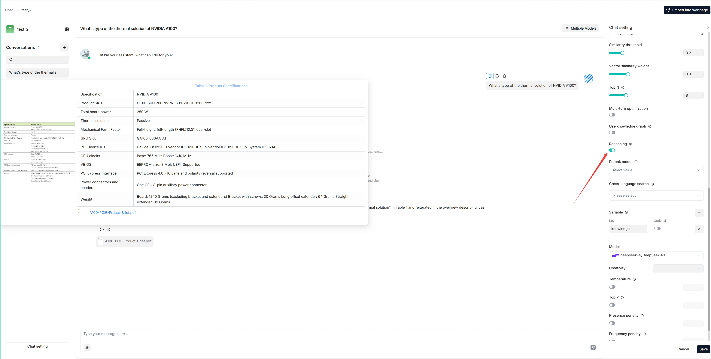
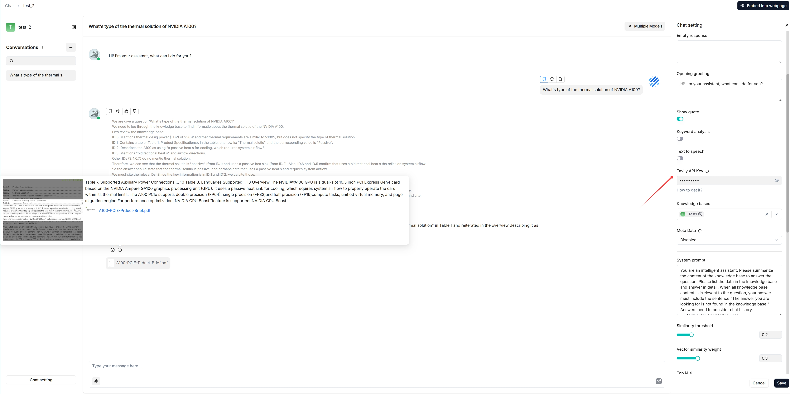
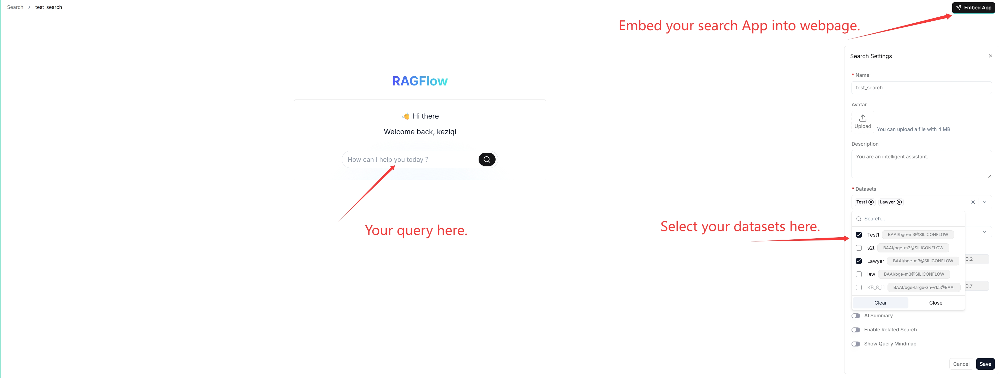

# Chat

Chats in RAGFlow are based on one or more datasets. Once you have created a dataset, parsed its files, and [run a retrieval test](./knowledge-bases.md#run-a-retrieval-test), you can start an AI conversation by creating a **chat assistant**. Each assistant is a dialogue with its own combination of datasets, prompts, hybrid-search settings, and model settings.

## Create a chat assistant

Click the **Chat** tab at the top of the page, then **Create an assistant** to open the **Chat Configuration** dialogue.

### Assistant settings

- **Assistant name** — the name of your chat assistant.
- **Empty response**:
  - To *confine* answers to your datasets, enter a response here. When nothing is retrieved, the assistant uniformly replies with it.
  - To let the assistant *improvise* when nothing is retrieved, leave it blank (this may lead to hallucinations).
- **Show quote** — a key RAGFlow feature, enabled by default. It clearly shows the sources each response is based on.
- **Datasets** — select one or more datasets. Ensure they use the same embedding model, otherwise an error occurs.

### Prompt settings

- **System** — the system prompt for your LLM. You can leave the default as-is to start.
- **Similarity threshold** — chunks with a similarity below this bar are filtered out. Default: **0.2**.
- **Vector similarity weight** — the weight of vector similarity in the hybrid score. Default: **0.3** (so keyword similarity weight is 0.7). If a rerank model is selected, the reranker score is combined with keyword similarity instead.
- **Top N** — the maximum number of chunks fed to the LLM, even if more are retrieved.
- **Multi-turn optimization** — enhances queries using prior context in multi-round conversations. Enabled by default; consumes extra tokens and increases response time.
- **Reasoning** — generate answers through reasoning (like Deepseek-R1 / OpenAI o1). When enabled, the model integrates deep research for unknown topics. See [Deep research](#deep-research) below.
- **Rerank model** — the reranker to use. Empty by default. Selecting one significantly increases response time.
- **Cross-language search** — select one or more target languages; the default chat model translates your query into them for accurate matching across languages. Ensure those languages are present in the dataset.
- **Variable** — variables used in the system prompt. See [Variables](#variables) below.

### Model settings

- **Model** — the chat model for this assistant (from the DKubeX provider; see [Using models on DKubeX](./models.md)). You can pick a different model per assistant.
- **Creativity** — a shortcut preset for **Temperature**, **Top P**, **Presence penalty**, and **Frequency penalty**:
  - **Improvise** — more creative responses.
  - **Precise** — (Default) more conservative responses.
  - **Balance** — a middle ground.
- **Temperature** — randomness of output. Default **0.1**. Lower is more deterministic; zero gives the same output for the same prompt.
- **Top P** — nucleus sampling threshold. Default **0.3**.
- **Presence penalty** — encourages a more diverse range of tokens. Default **0.4**.
- **Frequency penalty** — discourages repeating the same words or phrases. Default **0.7**.

Then start chatting:

> **Tip:** Click the light-bulb icon above an answer to view the expanded system prompt (available for the current dialogue only), and scroll down it to see the time consumed for each task.
>
> 

## Update an existing chat assistant

Hover over an assistant and edit it to update its settings.

## Variables

Variables let you dynamically adjust the system prompt.

- **`{knowledge}`** — the system's reserved variable, representing the chunks retrieved from the datasets selected under **Assistant settings**. Keep it if your assistant is associated with datasets. From v0.17.0 onward you can chat without specifying datasets — in that case, remove `{knowledge}` and keep **Empty response** blank to avoid errors.
- **Custom variables** — variables you define to pair with the system prompt. The **Optional** toggle controls whether a variable is required (disabled = mandatory, enabled = optional).

> **Important:** Variables are closely linked to the system prompt. When you add a variable, include it in the system prompt; when you delete one, remove it from the prompt too, otherwise an error occurs.

## Deep research

From v0.17.0 onward, RAGFlow can integrate agentic reasoning into a chat. To activate it:

1. Enable the **Reasoning** toggle in the chat settings.

   

2. Enter a valid Tavily API key to enable Tavily-based web search.

   

## AI search

An **AI search** is a single-turn conversation using a predefined retrieval strategy (a hybrid search of weighted keyword similarity and weighted vector similarity) and the default chat model. Unlike a chat assistant, it does not use advanced strategies like knowledge graph, auto-keyword, or auto-question, and the related chunks are listed below the answer in descending order of similarity.

Before using it, ensure your default models are set on the **Model providers** page (see [Using models on DKubeX](./models.md)) and that your datasets are configured and parsed.

> **Tip:** When debugging a chat assistant, use AI search as a reference to verify your model settings and retrieval strategy. The key difference: a chat is multi-turn with configurable retrieval and model choice (and retrieved chunks are not shown alongside the answer), whereas an AI search is single-turn with a fixed strategy that lists the retrieved chunks.
