# Knowledge Bases

Most of RAGFlow's chat assistants and agents are built on **datasets** (knowledge bases). A dataset parses the files you upload into real "knowledge" that future AI chats draw on. This page covers creating a dataset, configuring how it parses and chunks your files, tuning retrieval, and managing files.

Before you begin, make sure you have set up chat, embedding, and (optionally) rerank models — see [Using models on DKubeX](./models.md).

## Create a dataset

With multiple datasets, you can build more flexible, diversified question answering.

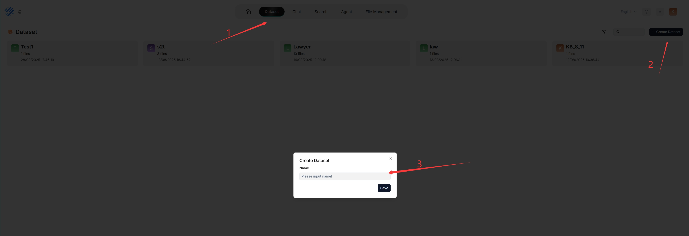

## Configure a dataset

A proper configuration is crucial: choosing the wrong embedding model or chunking method can cause semantic loss or mismatched answers.

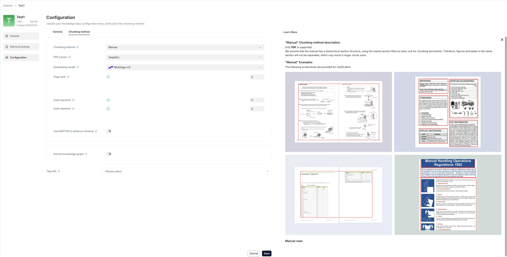

### Select a chunking method

RAGFlow offers multiple built-in chunking templates to handle files of different layouts while preserving semantic integrity. From the **Built-in** chunking method dropdown under **Parse type**, choose the template that suits your files:

| Template | Description | File format |
|--------------|-------------------------------------------------------------------------------|---------------------------------------------------------------------------------------------------------|
| General | Files are consecutively chunked based on a preset chunk token number. | MD, MDX, DOCX, XLSX, XLS (Excel 97-2003), PPT, PDF, TXT, JPEG, JPG, PNG, TIF, GIF, CSV, JSON, EML, HTML |
| Q&A | Retrieves relevant information and generates answers to respond to questions. | XLSX, XLS (Excel 97-2003), CSV/TXT |
| Resume | Enterprise edition only. | DOCX, PDF, TXT |
| Manual | | PDF |
| Table | The table mode uses TSI technology for efficient data parsing. | XLSX, XLS (Excel 97-2003), CSV/TXT |
| Paper | | PDF |
| Book | | DOCX, PDF, TXT |
| Laws | | DOCX, PDF, TXT |
| Presentation | | PDF, PPTX |
| Picture | | JPEG, JPG, PNG, TIF, GIF |
| One | Each document is chunked in its entirety (as one). | DOCX, XLSX, XLS (Excel 97-2003), PDF, TXT |
| Tag | The dataset functions as a tag set for the others. | XLSX, CSV/TXT |

You can also change a file's chunking method later on the **Files** page.

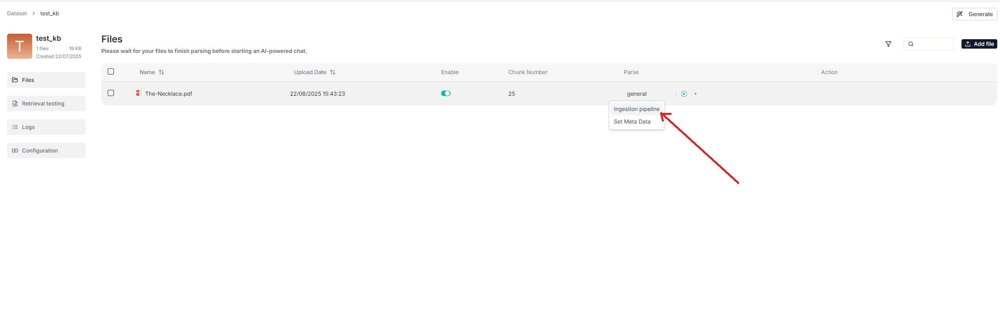

### Select an embedding model

An embedding model converts chunks into embeddings. On DKubeX, choose an embedding model from the DKubeX provider (see [Using models on DKubeX](./models.md)).

The embedding model **cannot be changed once the dataset has chunks** — to switch, you must first delete all existing chunks in the dataset. This ensures every file in a dataset is embedded in the same embedding space.

> **Note:** Some embedding models are optimized for specific languages, so performance may be compromised if you use them to embed documents in other languages.

### Select a PDF parser

From v0.17.0 onward, RAGFlow decouples data extraction from chunking **for PDF files**, so you can choose a visual model for OCR (Optical Character Recognition), TSR (Table Structure Recognition), and DLR (Document Layout Recognition). If your PDFs contain only plain text, select **Naive** to skip these tasks and reduce parsing time.

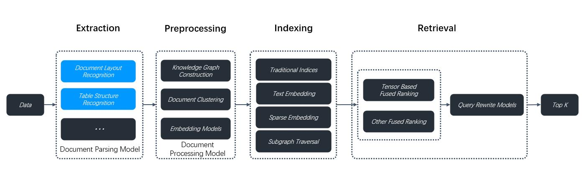

The **PDF parser** dropdown appears only when you select a chunking method compatible with PDFs (**General**, **Manual**, **Paper**, **Book**, **Laws**, **Presentation**, **One**). Options:

- **DeepDoc** — (Default) The default visual model performing OCR, TSR, and DLR tasks on PDFs; thorough but can be time-consuming.
- **Naive** — Skip OCR, TSR, and DLR if *all* your PDFs are plain text.
- **MinerU** — (Experimental) An open-source tool that converts PDF into machine-readable formats.
- **Docling** — (Experimental) An open-source document processing tool for gen AI.
- A third-party visual model from a model provider.

> **Note:** To use a third-party visual model, set a default VLM under **Set default models** on the **Model providers** page. Third-party visual models are marked **Experimental**.

### Enable Excel to HTML

When using the **General** chunking method, enable the **Excel to HTML** toggle to convert spreadsheet files into HTML tables. If disabled, spreadsheet tables are represented as key-value pairs. For complex tables (multiple columns, merged cells, or multiple tables in one sheet) that cannot be represented that way, enable this feature.

> **Warning:** This feature is disabled by default and applies only to spreadsheet files (XLSX or XLS). If your dataset has complex tables and you do not enable it, RAGFlow will not error, but your tables are likely to be garbled. When enabled, spreadsheet tables with more than 12 rows are split into chunks of 12 rows each.

### Set a parent-child chunking strategy

A single chunk must serve both precise recall (fine-grained chunks) and answer generation (coherent, complete context) — two conflicting goals. RAGFlow's parent-child chunking resolves this: a document is first segmented into larger **parent chunks** (complete semantic units), each subdivided into **child chunks** for precise recall. During retrieval, the system locates the most relevant child chunk and automatically associates and recalls its parent chunk — keeping recall precise while providing ample context for generation.

On your dataset's **Configuration** page, find the **Child chunks are used for retrieval** toggle and set the delimiter for child chunks.

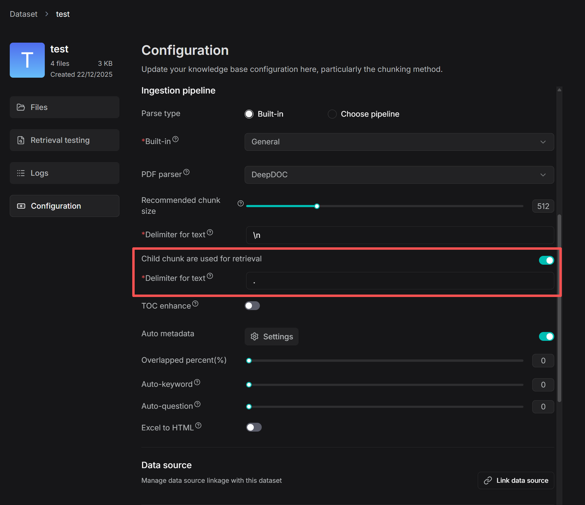

### Set the image & table context window

By default, images and tables extracted from a document's layout are treated as independent chunks, so they are not retrieved unless the query matches them directly. The **Image & table context window** feature groups surrounding text with adjacent visuals into a single chunk based on a configurable window size, so they are retrieved together — improving recall for charts and tables.

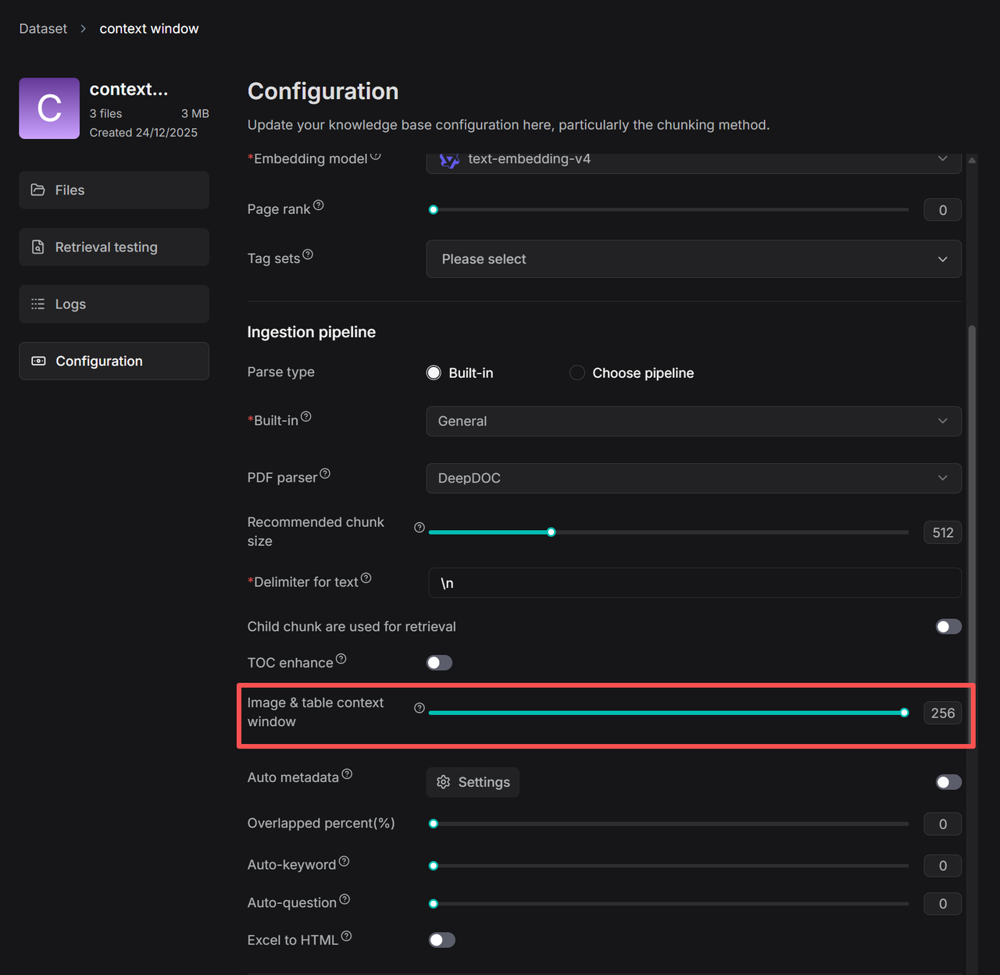

Adjust the number of context tokens with the slider. Approximately that many tokens of text from above and below the image/table are captured and inserted into its chunk as context; boundaries are optimized at punctuation marks to preserve meaning.

### Set page rank

If you want information from certain datasets to take precedence during retrieval, use page rank to boost the ranking of chunks from those datasets. For example, with a chat assistant drawing from dataset A (2024 news) and dataset B (2023 news), you can prioritize 2024 news.

On the **Configuration** page, drag the **Page rank** slider (or type a value in the field next to it).

> **Note:** Page rank operates at the level of the entire dataset, not individual files. The value must be an integer in the range [0, 100] — `0` disables it (default), a specific value enables it.

**Scoring:** If a chat assistant's **similarity threshold** is 0.2, only chunks with a hybrid score above 0.2 × 100 = 20 are retrieved. If dataset A has page rank 1 and dataset B has 0, a chunk from A with an initial score of 50 gets a boost of 1 × 100 = 100, for a final score of 150 — so chunks from A always precede chunks from B.

## Upload and parse files

- RAGFlow's File system lets you link one file to multiple datasets, where each dataset holds a *reference* to the file.
- In a dataset you can also upload a single file or a folder (bulk upload) from your local machine, in which case the dataset holds file *copies*.

> We recommend uploading files to RAGFlow's File system and then linking them to your datasets. That way you can delete parsed files or a whole dataset without permanently losing the originals.

File parsing does two things: chunking files based on layout, and building embedding and full-text (keyword) indexes on those chunks. After selecting the chunking method and embedding model, start parsing:

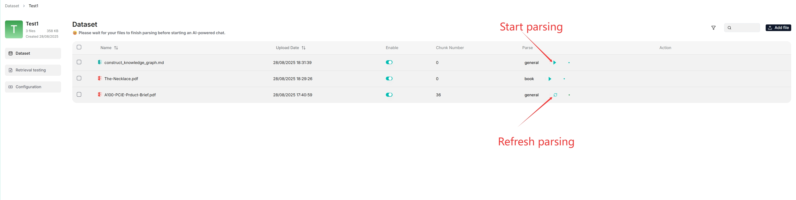

You can use a different chunking method for a particular file, and enable or disable individual files for finer control.

### Intervene with parsing results

RAGFlow lets you view chunking results and intervene where necessary:

1. Click a file that has finished parsing to open the **Chunk** page and view its chunks.

   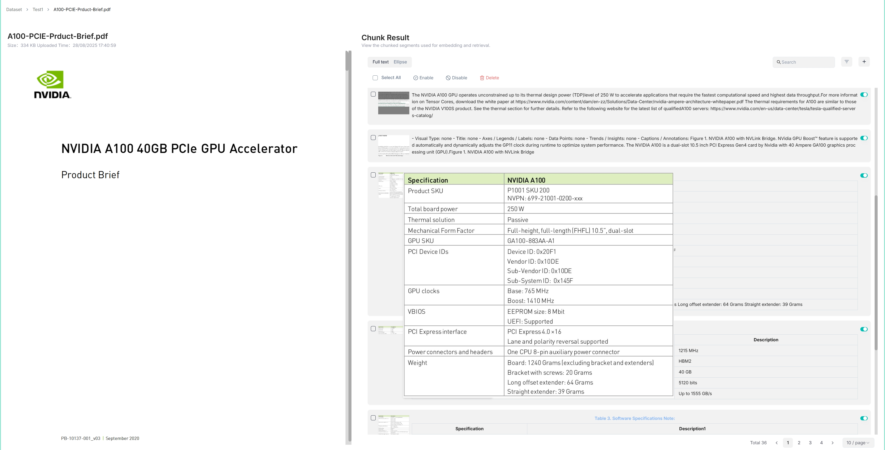

2. Hover over each snapshot for a quick view of a chunk.
3. Double-click a chunk to add keywords, questions, tags, or make manual changes.

   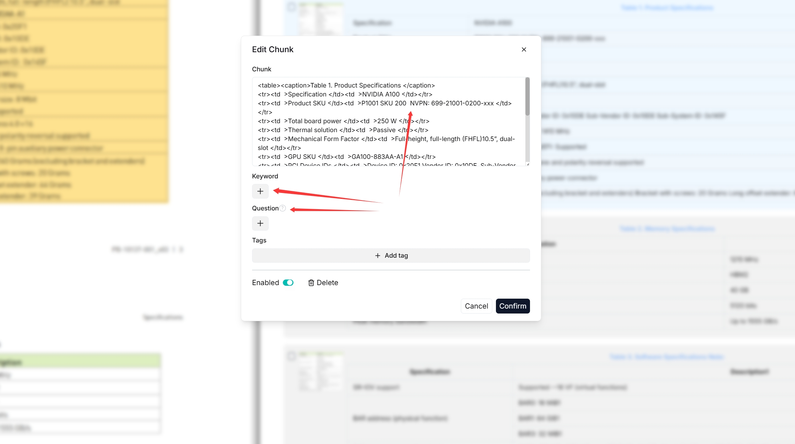

4. In **Retrieval testing**, ask a quick question in **Test text** to confirm your configuration works.

> **Note:** Adding keywords to a chunk increases its keyword weight and can improve its position in the search list for queries containing those keywords.

## Manage metadata

From v0.23.0 onward, you can manage metadata at the dataset level and for individual files. Metadata such as URL, author, or date is sent to the LLM together with the retrieved chunks during generation — for example, add a `url` field so the model can cite the source.

1. Click **Metadata** within your dataset to open the **Manage Metadata** page.

   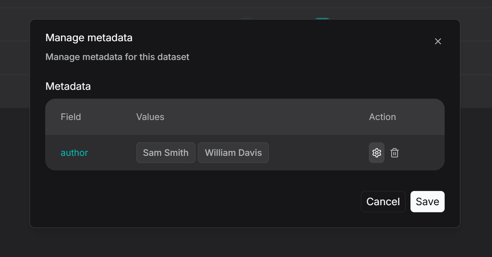

2. Here you can **edit values** (renaming two values to be identical merges them) or **delete** specific values or entire fields (applies to all associated files).
3. To manage metadata for a single file, open the file's details, click the parsing method (e.g. **General**), then **Set Metadata** to add, delete, or modify fields for that file.

   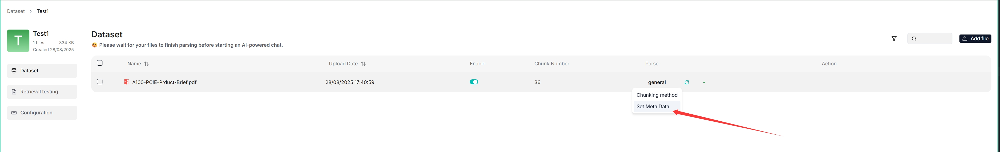

   > **Note:** Metadata must be in JSON format, otherwise your updates will not be applied.

4. Use the **Filter** button in a dataset to see how many files are linked to each metadata value and to display those files.

   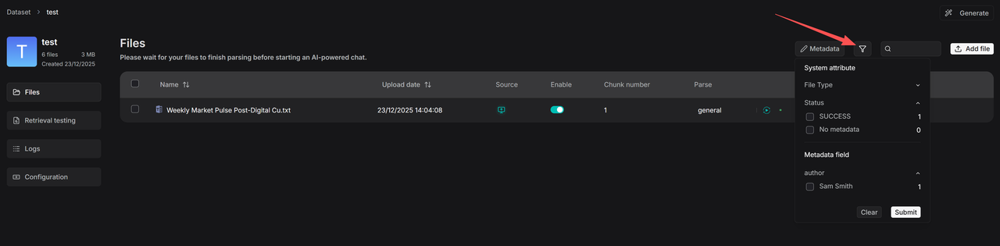

5. Metadata filtering is also supported during retrieval. In **Chat**, after configuring a knowledge base, you can set metadata filtering rules:

   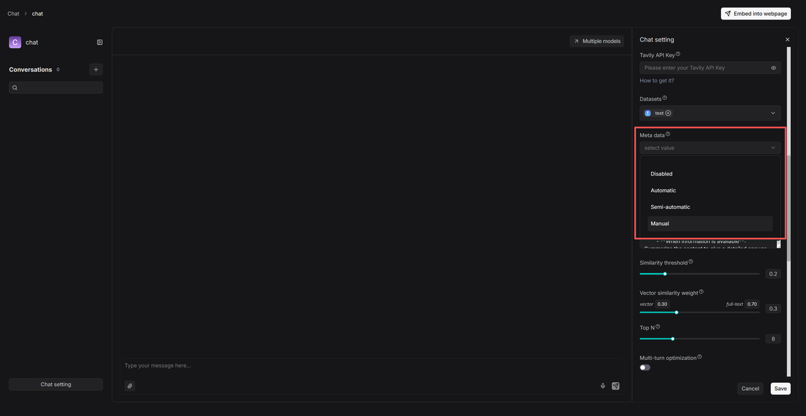

   - **Automatic** — the system filters documents based on the query and existing metadata.
   - **Semi-automatic** — you define the filtering scope at the field level (e.g. **Author**), then the system filters within that range.
   - **Manual** — you set precise, value-specific conditions with operators such as **Equals**, **Not equals**, **In**, and **Not in**.

## Use tag sets

A **tag set** automatically maps user-defined tags to relevant chunks based on similarity — an extra layer of domain knowledge, useful when many chunks are so similar that the intended ones are hard to distinguish (e.g. a few chunks about "iPhone" among many about "iPhone case").

> **Important:** A tag set is *not* involved in indexing or retrieval directly. Do not select a tag set when configuring a chat assistant or agent.

**1. Create a tag set.** Prepare a tag table file (XLSX, CSV, or TXT) with two columns — **Description** (example chunks or queries; similarity is computed against each chunk) and **Tag** (tags to apply, comma-separated for multiple). Then:

1. Click **+ Create dataset**.
2. On its **Configuration** page, select **Built-in** in **Ingestion pipeline**, then choose **Tag** as the chunking method.
3. Upload and parse your table file. A tag cloud appears under **Tag view**, and the **Table** tab shows the tag frequency table.

**2. Tag chunks.** On your dataset's **Configuration** page, select the tag set from the **Tag sets** dropdown, click **Save**, then re-parse your documents to start auto-tagging. In chats, each query is tagged with the tag set, and chunks with matching tags have a higher chance of retrieval.

**3. Update a tag set.** Edit tag names or delete tags in the tag frequency table (**Table** tab), or add new table files. After updating a tag set, re-parse your documents so their tags update accordingly.

## Run a retrieval test

After files are uploaded and parsed, run a retrieval test before configuring a chat assistant — it verifies whether the intended chunks can be recovered, so you can quickly pinpoint what to improve.

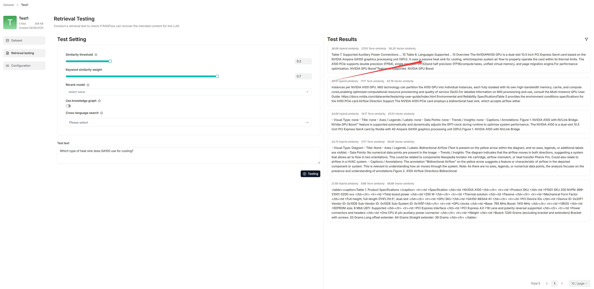

During a test, chunks are retrieved using hybrid search combining weighted keyword similarity with either weighted vector cosine similarity or a weighted reranking score:

### Similarity threshold

Chunks with similarities below the threshold are filtered out. Default: **0.2** — only chunks with a hybrid score of 20 or higher are retrieved.

### Vector similarity weight

The weight of vector similarity in the composite score. Default: **0.3**, making the weight of keyword similarity 0.7 (1 − 0.3).

### Rerank model

- If left empty, RAGFlow combines weighted keyword similarity with weighted vector cosine similarity.
- If a rerank model is selected, weighted keyword similarity is combined with the weighted vector reranking score.

> **Important:** Using a rerank model significantly increases response time.

### Cross-language search

Select one or more target languages from the dropdown to have the default chat model translate your query into those languages, ensuring accurate semantic matching across languages.

> **Note:** Ensure the selected languages are present in the dataset. If no target language is selected, the system searches only in the language of your query.

### Test text and procedure

1. On the **Retrieval testing** page, enter your query in **Test text** and click **Testing**.
2. If results are unsatisfactory, tune the options above and rerun.

> **Warning:** Changes you make here (such as keyword similarity weight or similarity threshold) are not saved automatically. Apply them to your chat assistant settings or the **Retrieval** agent component settings.

## Manage files

RAGFlow's file management lets you upload files individually or in bulk and link an uploaded file to multiple datasets. Uploading to file management and then linking (rather than uploading directly to a dataset) lets you delete parsed files or a whole dataset while keeping the originals.

- **Create folders** to organize your file system with nested structures.
- **Upload files** from your local machine, individually or in bulk.
- **Preview files** — Documents (PDF, DOCX), Tables (XLSX), and Pictures (JPEG, JPG, PNG, TIF, GIF).
- **Link a file to datasets** — creates a reference in each target dataset. Deleting a file in file management automatically removes all related references across datasets.
- **Move, search, rename, and delete** files or folders (search matches names in the current directory only).

> Deleting files that have been linked to datasets **automatically removes** all associated references across those datasets.

## Search for and delete a dataset

Use the search bar to find a dataset by name.

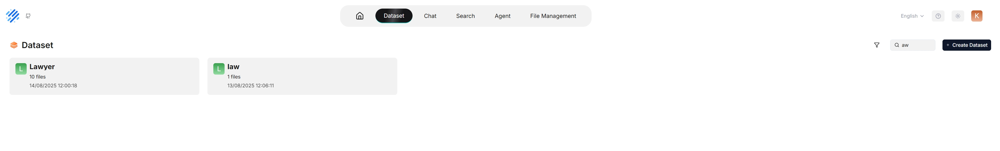

To delete a dataset, hover over the three-dot menu on its card and click **Delete**. Deleting a dataset removes the files uploaded directly to it; file *references* created from RAGFlow's File system are removed, but the underlying files still exist.

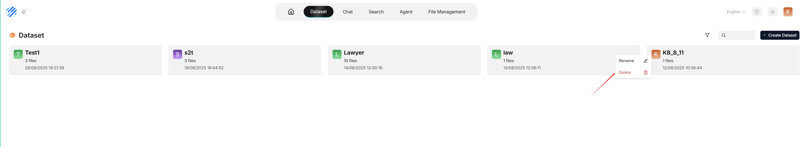
