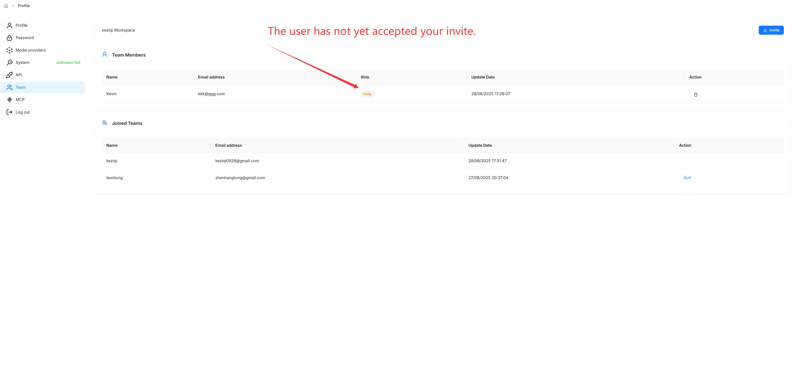
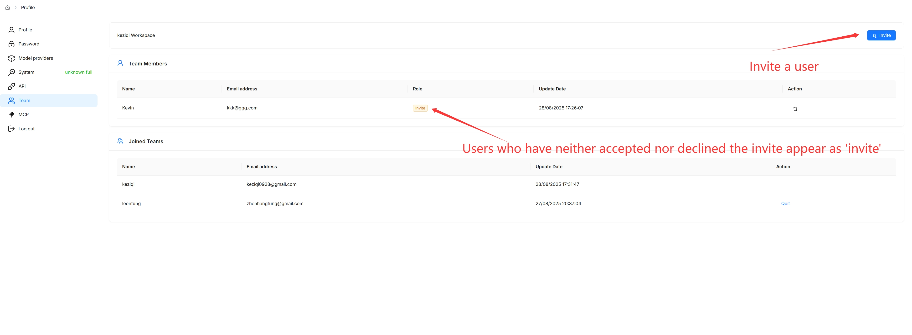
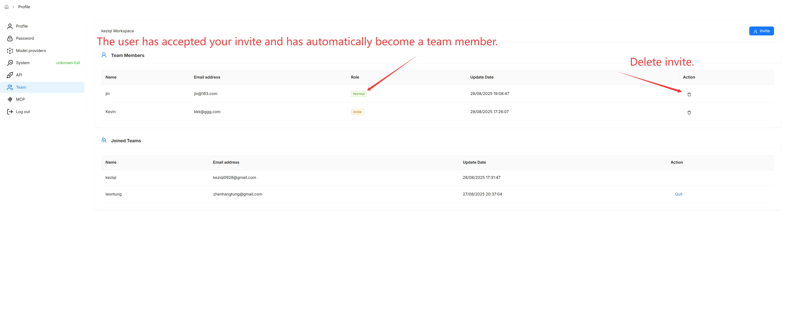

# Team & Sharing

By default, each RAGFlow user has a single team named after them. You can invite other RAGFlow users to your team and share your work with them. Team members can:

- Upload documents to your shared datasets.
- Parse documents in your shared datasets.
- Use your shared agents.

## Manage team members

Click your avatar in the top-right of the page, then select **Team** in the left-hand panel to open the **Team** page, where you can see your team and the teams you have joined.

You are the owner of your own team and the only person who can invite or remove members.

**Invite a member:**

- Ensure the invitee is a RAGFlow user and that the email address you use is associated with their RAGFlow account.

**Remove a member:**

## Join or leave a team

When you receive an invitation, you are notified in the top-right corner of the page. Open the **Team** page (avatar → **Team**) to accept or decline it. After accepting, you can view and update the team owner's datasets whose **Permissions** are set to **Team**. You can also leave a team you have joined from the same page.

> You cannot invite users to a team unless you are its owner.

## Share your work

Nothing is shared automatically — you enable sharing per item by switching its **Permissions** from **Only me** to **Team**.

**Share a dataset:**

1. Navigate to the dataset's **Configuration** page.
2. Change **Permissions** from **Only me** to **Team**.
3. Click **Save**.

**Share an agent:**

1. Open the agent's editing canvas.
2. Click **Management** → **Settings**.
3. Change **Permissions** from **Only me** to **Team**, then **Save**.

**Share a memory:**

1. Open the memory's editing canvas from the **Memory** page.
2. Click **Configurations**.
3. Change **Permissions** from **Only me** to **Team**, then **Save**.

> Sharing chat assistants and sharing models are currently exclusive to RAGFlow's Enterprise edition.
