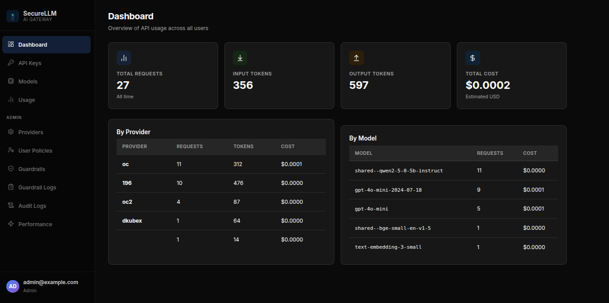
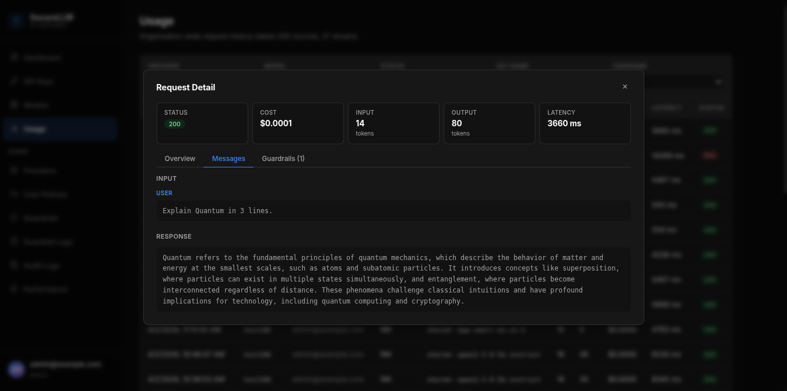

# Core Features

Once you log in, the sidebar shows four pages available to every user: **Dashboard**, **API Keys**, **Models**, and **Usage**.

## Dashboard

The Dashboard gives you a snapshot of your AI usage at a glance.

- **Total Requests** — how many AI calls you have made
- **Input / Output Tokens** — a measure of how much text was sent and received (tokens ≈ words)
- **Total Cost** — estimated spend based on your requests
- **By Provider / By Model** — tables showing which AI services and models you used most

> **Note:** If you have admin access, the Dashboard shows usage for your entire organization, not just your own.

## API Keys

An API key is like a password that lets an application (a script, a tool, or an IDE plugin) talk to SecureLLM on your behalf. You create keys here and paste them into whichever tool needs them.

**Creating a key:**

1. Click **API Keys** in the sidebar.
2. Click **Create Key**.
3. Enter a descriptive name (e.g., `my-vscode-plugin` or `data-pipeline`).
4. Click **Create**.
5. **Copy the key immediately** — it is only shown once. Store it somewhere safe (a password manager or `.env` file).

**Revoking a key:**

1. Find the key in your list.
2. Click **Revoke**.
3. Confirm the action.

> **Tip:** If you suspect a key has been leaked or is no longer needed, revoke it right away. Revoking a key instantly stops any further requests made with it.

## Models

The Models page lists every AI model available to you through SecureLLM.

- Use the **search bar** to find a specific model by name.
- Use the **Provider** and **Category** filters to narrow the list (e.g., Chat, Reasoning, Embedding).
- Click the **copy icon** next to a model name to copy its identifier — paste this directly into your code or tool.

> **Note:** If an admin has restricted your access, you will only see the models and providers your organization has made available to you.

## Usage (My Requests)

The Usage page shows your request history — everything you or your keys have sent to SecureLLM.

- Use the **filters** at the top to narrow by provider, model, status, or API key name.
- Click any row to open the **Request Detail** panel, which shows:
  - The exact messages sent and the AI's response
  - Request status, cost, token counts, and latency
  - Any guardrail events triggered by that request
