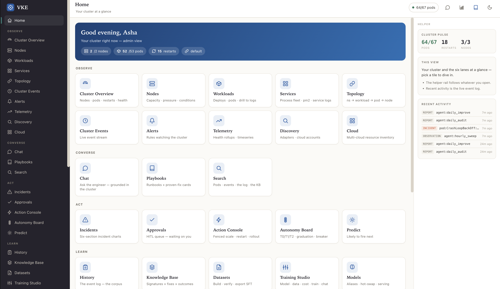

# VKE — Virtual Kubernetes Engineer

VKE is a self-improving SRE console that runs **inside** your cluster. It observes the
workloads around it through its own read-only ServiceAccount, answers questions grounded
in real cluster state via any OpenAI-compatible AI endpoint, proposes and (with approval)
applies fenced remediations, and carries a Training Studio for fine-tuning domain models
on your incident history — all behind a single tile-based console.



## Key features

- **Observe** — Cluster overview, nodes, workloads, services, topology, events, alerts, telemetry, discovery, and cloud context at a glance.
- **Converse** — Chat grounded in live cluster state, reusable playbooks, and full-text search across events and knowledge.
- **Act** — Incident tracking, human-in-the-loop approvals, a fenced Action Console (scale / rollout-restart — never delete), an Autonomy Board, and predictive signals.
- **Learn** — Event history, a shadow-mode knowledge base, datasets, the Training Studio, and served models.
- **Oversight** — Analytics, the improvement flywheel, and hash-chained audit trails.
- **Role-based access** — PIN login mapped to roles (admin, SRE lead, operator, ML engineer, exec, demo); tiles are gated per role.
- **Read-only by default** — the cluster ServiceAccount carries no write verbs unless you explicitly opt in (cluster-wide or per-namespace).

## Tutorials

- [Getting started](./getting-started.md) — Open VKE, log in with your PIN, and take the tour.
- [Core features](./user-features.md) — Observe, Converse, and Act for everyday users.
- [Administrator features](./admin-features.md) — Users, autonomy tiers, training, and audit.
- [Workflows](./tutorials.md) — End-to-end walkthroughs for common tasks.

## At a glance

| Lane | Regular user | Administrator |
|---|---|---|
| Observe | View cluster state, events, telemetry | Same + configure discovery/cloud |
| Converse | Chat, playbooks, search | Same + manage playbooks |
| Act | Propose fixes, request approval | Approve/deny, toggle autonomy tiers |
| Learn | Browse KB, datasets, models | Manage datasets, run Training Studio |
| Oversight | View own activity | Analytics, flywheel, audit logs |
| Admin | — | Users, config, master switch |

```{toctree}
:hidden:

getting-started
user-features
admin-features
tutorials
```
