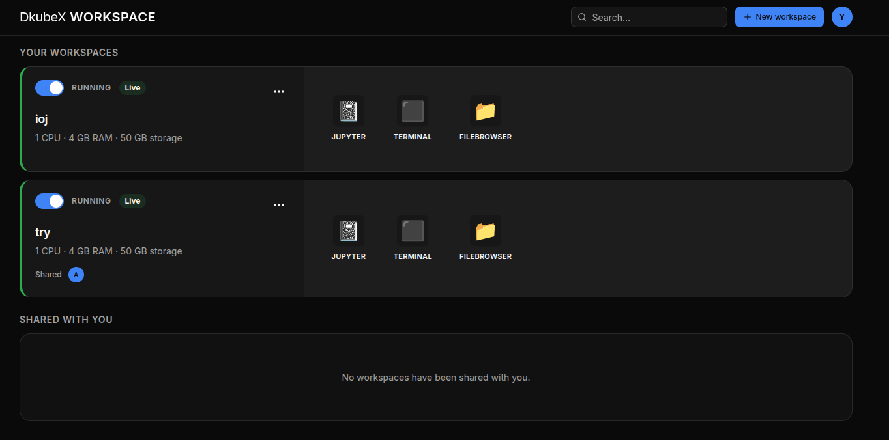
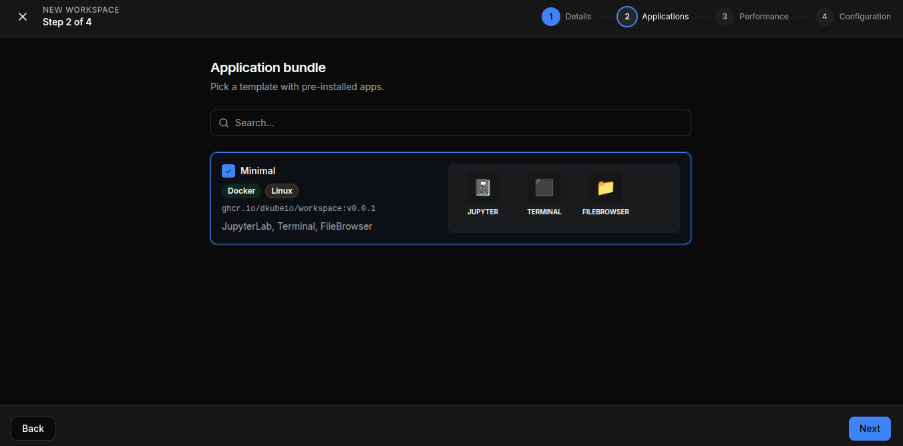
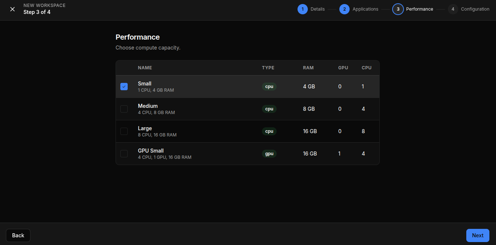

# Getting Started

DKubeX Workspace gives you a personal, on-demand development environment running in the cluster. This guide covers logging in, finding your way around the Home dashboard, and creating your first workspace.

## Logging In

DKubeX Workspace uses your organization's single sign-on (SSO). Navigate to the app URL and you are logged in automatically with your existing credentials — no separate account or password needed.

## Home Dashboard

After logging in, the **Home** page is your central hub. It shows two sections:

- **Your Workspaces** — workspaces you own
- **Shared with You** — workspaces others have shared with you

Each workspace card shows its name, current status, resource configuration, and quick-action buttons. Use the **search bar** at the top to filter by name, description, or owner.

## Creating a Workspace

The new workspace wizard walks you through four steps:

**Step 1 — Details:** Click **New Workspace** (or **+ New workspace**) on the Home page, then enter a **name** for your workspace.

**Step 2 — Applications:** Pick an **application bundle** — a template that determines which apps come pre-installed (e.g., the *Minimal* bundle includes JupyterLab, Terminal, and FileBrowser).

**Step 3 — Performance:** Choose a **compute profile** that sets the CPU, GPU, and RAM allocated to your workspace.

| Profile | CPU | RAM | GPU |
|---|---|---|---|
| Small | 1 | 4 GB | 0 |
| Medium | 4 | 8 GB | 0 |
| Large | 8 | 16 GB | 0 |
| GPU Small | 4 | 16 GB | 1 |

**Step 4 — Configuration:** Review and confirm any final settings, then click **Create**.

The workspace card will appear on the Home page with a **Creating** status. Once the pod is ready, the status changes to **Running**.

> **Tip:** Start with a smaller compute profile and scale up later — you can edit resource settings without losing your data.

## Next Steps

- Learn the [full workspace lifecycle](./managing-workspaces.md) — statuses, start/stop, archive, and delete.
- See how to [use apps, manage files, and share](./using-your-workspace.md) your workspace.
- Follow an [end-to-end workflow](./tutorials.md).
