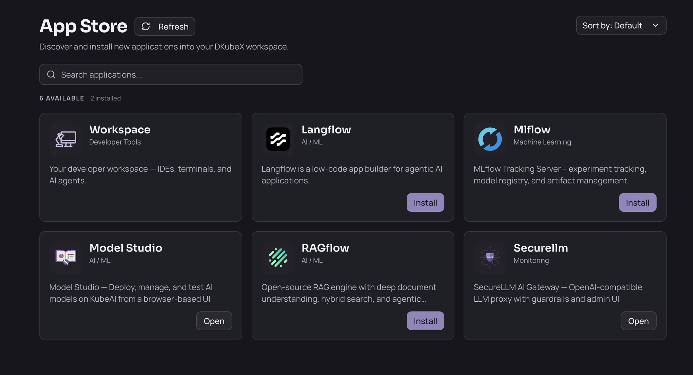

# Getting Started

DKubeX Workspace gives you a personal development environment running in the cluster. This guide covers logging in, installing your workspace, and opening your first app.

## Logging In

DKubeX uses your organization's single sign-on (SSO). Navigate to the DKubeX URL and you are logged in automatically with your existing credentials — no separate account or password needed.

## Installing Your Workspace

Your workspace is an app in the **App Store**, and you install it yourself. There is no setup wizard.

1. Click **App Store** in the sidebar.
2. Find the **Workspace** card and click **Install**.
3. The status changes to **Provisioning** while the environment is created.
4. When the status reaches **Running**, your workspace is ready.

Provisioning usually takes a minute or two on first install — the workspace image is large and has to be pulled onto the node.

> **Note:** You get **one** workspace, and it is yours alone. Its CPU, memory and GPU allocation comes from defaults your administrator configures; there is nothing to choose during install and no compute-profile picker.

## Opening Your First App

Once the workspace is **Running**, the apps inside it appear as individual tiles in **Apps** — one tile per app, alongside any other applications you have access to.

1. Go to **Apps**.
2. Click the tile for the app you want — for example **JupyterLab**.
3. The app opens inside DKubeX. The first time you open it, it takes a few seconds to start and shows a loading screen; after that it opens immediately.

Each app keeps running while you switch between others, so you can move between JupyterLab, a terminal and an agent without losing your place.

> **Tip:** App tiles only appear while your workspace is **Running**. If **Apps** shows no workspace apps, check your workspace status in the App Store first.

## What You Get

| App | What it is |
|---|---|
| **JupyterLab** | Notebooks and interactive Python |
| **VS Code** | code-server IDE in the browser |
| **Terminal** | Interactive bash shell |
| **FileBrowser** | Browse and manage your files |
| **Claude Code** | Anthropic's agentic coding CLI |
| **OpenCode** | Open-source terminal coding agent |
| **Antigravity** | Google's terminal coding agent (`agy`) |
| **Codex** | OpenAI's coding agent CLI |
| **Copilot CLI** | GitHub Copilot in the terminal |
| **Mistral Vibe** | Mistral's coding agent CLI |
| **OpenClaw** | Multi-model agent gateway and web UI |
| **Hermes** | Nous Research's agent |
| **Pi** | Minimal, extensible coding agent harness |

The nine coding agents can be pointed at your organization's models by picking a default model in your workspace settings, or left on their own sign-in so you can use a personal subscription — see [Working with AI agents](./working-with-agents.md).

## Next Steps

- Learn [what persists and how to manage your workspace](./managing-workspaces.md).
- See how to [use apps, files, ports and SSH](./using-your-workspace.md).
- Start [working with the AI agents](./working-with-agents.md).
- Follow an [end-to-end workflow](./tutorials.md).
