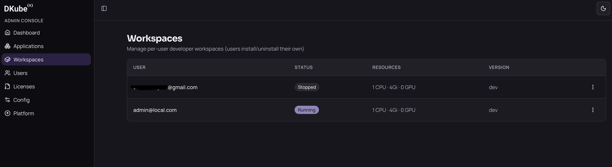

# Managing Your Workspace

This page covers the statuses your workspace can have, which actions are yours and which belong to an administrator, what survives a restart, and how to remove your workspace.

## Workspace Statuses

| Status | What it means |
|---|---|
| **Provisioning** | The workspace is being created; wait for it to finish |
| **Running** | The workspace is up and its apps are available in Apps |
| **Stopped** | The pod is scaled down; your home directory is untouched |
| **Failed** | Something went wrong — contact your administrator |

To see your workspace's status, open the **App Store** and click the **Workspace** card — the status is shown on its detail page.

## What You Can Do

You have two actions, both on the **Workspace** page in the App Store:

- **Install** — creates your workspace.
- **Uninstall** — removes it (see below).

## What Only an Administrator Can Do

The following are **admin-only** and are not available to you, even for your own workspace:

- **Start** and **Stop** the pod
- **Edit** CPU, memory, GPU, image version and tolerations

If your workspace is **Stopped** and you need it running again, ask your administrator to start it. Uninstalling and reinstalling also gets you a running workspace, but it deletes the workspace volume — see the warning below before doing that.

Administrators manage every workspace from the admin console, where they can see its status and resources and start or stop it:



## What Persists

This is the most important thing to know about your workspace.

**Your home directory persists.** Everything you save there survives pod restarts, stops, and even uninstalling and reinstalling your workspace.

## Uninstalling

Uninstall from the **Workspace** page in the App Store. You will be asked to confirm.

- **Your home files are kept.** They live on your user storage, which the workspace does not own.
- **The workspace's own volume is deleted.**
- **Anything you installed outside your home directory is gone.** System packages from `sudo apt install`, anything added to the default `python`/`pip` environment, and any Docker images you built or pulled are all removed with the workspace.

Your home directory is the exception, so it is the safest place for an environment you do not want to rebuild. A virtual environment there survives an uninstall and is still ready to use after you reinstall:

```bash
source ~/.venvs/myproject/bin/activate
python -c "import pandas"    # still installed
```

Before uninstalling, make sure anything you want to keep lives under your home directory.

> **Warning:** Uninstall is the only way for you to remove a workspace, and it is also the only way to recover from a **Stopped** workspace without an administrator.

## Getting Help

If your workspace stays in **Provisioning** for more than a few minutes, or reaches **Failed**, contact your platform administrator — they can look into what went wrong and restart or resize your workspace.
