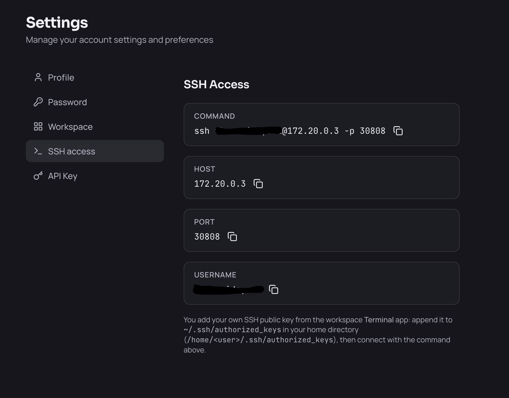

# Workflows

These walkthroughs chain together the individual tasks described in [Getting started](./getting-started.md), [Managing your workspace](./managing-workspaces.md), [Using your workspace](./using-your-workspace.md) and [Working with AI agents](./working-with-agents.md) into common, end-to-end scenarios.

## Install your workspace and start working in JupyterLab

1. Click **App Store** in the sidebar.
2. Find the **Workspace** card and click **Install**.
3. Wait for the status to go from **Provisioning** to **Running**.
4. Go to **Apps** — the workspace's apps now appear as individual tiles.
5. Click the **JupyterLab** tile. It takes a few seconds to start the first time.
6. Save your notebooks in your **home directory** so they persist across restarts.

## Use an AI coding agent on your own code

1. Open the **Terminal** app from **Apps** and clone your repository into your home directory:

   ```bash
   git clone https://github.com/your-org/your-repo.git ~/your-repo
   ```

2. Go to **Settings** → **Workspace**, pick a **Default model**, and click **Apply and restart**. Wait for the workspace to come back.
3. From **Apps**, open the agent you want — for example **Claude Code**. Because you set a default model in step 2, it starts already connected to your organization's models and there is no key to enter. (Skip step 2 and the agent will ask you to sign in with your own account instead.)
4. Point it at your project and start prompting. If it asks you to trust the folder, accept once — the choice persists.

To use an agent from a shell instead, open the **Terminal** app and run `claude`, `opencode`, `codex`, `copilot`, `vibe`, `hermes` or `pi` from your project directory.

## Install Python packages in your own environment

The default `python` and `pip` on your `PATH` install **outside** your home directory. Keeping a project's packages in a virtual environment under your home directory isolates them per project, and means they survive even if the workspace is uninstalled and reinstalled.

1. Open the **Terminal** app.
2. Create a virtual environment in your home directory and activate it:

   ```bash
   python3 -m venv ~/.venvs/myproject
   source ~/.venvs/myproject/bin/activate
   ```

3. Install what you need — it now lives in your home directory:

   ```bash
   pip install pandas scikit-learn
   ```

4. Make it the default for new terminals by appending the activation line to `~/.bashrc`:

   ```bash
   echo 'source ~/.venvs/myproject/bin/activate' >> ~/.bashrc
   ```

5. To use it in JupyterLab, register it as a kernel:

   ```bash
   pip install ipykernel
   python -m ipykernel install --user --name myproject
   ```

## Run a dev server and open it in your browser

1. Open the **Terminal** app and start your server on any port — for example:

   ```bash
   cd ~/your-repo && npm run dev -- --port 3000
   ```

2. Open `<your-workspace-url>/3000/` in your browser.
3. If the page loads blank or without styling, the app is generating absolute URLs. Configure its base path (for example Vite's `base`, or Next.js's `basePath`) to match `/<port>/`.

## Connect from your local editor over SSH

> **Prerequisite:** You need an SSH key pair on your own machine, and you must paste its **public** key into the workspace before you can connect — the workspace accepts keys only, and rejects every connection until yours is in place.
>
> Check whether you already have one, and print it to copy:
>
> ```bash
> cat ~/.ssh/id_ed25519.pub
> ```
>
> If that file does not exist, create the pair first, then print it again:
>
> ```bash
> ssh-keygen -t ed25519 -C "you@laptop"
> ```
>
> Copy the whole line, starting `ssh-ed25519` and ending with your comment. That is the value you paste in step 2. Never copy `id_ed25519` (no `.pub`) — that is your private key and must stay on your machine.

1. Go to **Settings** → **SSH access** and note the command, host, port and username. Each field has a copy button.

   

2. Open the **Terminal** app and paste your public key into your home directory:

   ```bash
   echo "ssh-ed25519 AAAA... you@laptop" >> ~/.ssh/authorized_keys
   ```

3. From your laptop, connect with the command shown on the settings page.
4. To use it from VS Code locally, add a matching `Host` entry to your `~/.ssh/config` and connect with the Remote-SSH extension.

Your key is stored in your home directory, so it keeps working after a restart.
