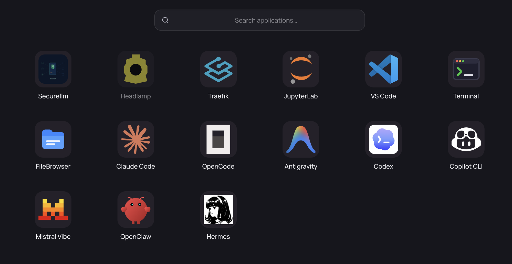

# Using Your Workspace

Once your workspace is **Running**, its apps appear in **Apps**, and you can work with files, run your own services, and connect over SSH.

## Using Apps

Your workspace ships twelve apps. Each one appears as its own tile in **Apps** while the workspace is running.



| App | What it is |
|---|---|
| **JupyterLab** | Notebooks and interactive Python |
| **VS Code** | code-server IDE in the browser |
| **Terminal** | Interactive bash shell |
| **FileBrowser** | Browse and manage your files |
| **Claude Code** | Anthropic's agentic coding CLI |
| **OpenCode** | Open-source terminal coding agent |
| **Antigravity** | Google's terminal coding agent (`agy`) |
| **Codex** | OpenAI's coding agent CLI |
| **Copilot CLI** | GitHub Copilot in the terminal |
| **Mistral Vibe** | Mistral's coding agent CLI |
| **OpenClaw** | Multi-model agent gateway and web UI |
| **Hermes** | Nous Research's agent |

The eight coding agents have their own page — see [Working with AI agents](./working-with-agents.md).

### Opening an App

Click its tile in **Apps**. The app opens inside DKubeX, so you stay in the same browser tab.

Apps are **started on demand**: the first time you open one, it takes a few seconds to launch and shows a loading screen, then appears. Afterwards it opens immediately. An app you never open never runs, which is why an idle workspace costs almost nothing.

Every app you open keeps running while you use others, so switching between JupyterLab, a terminal and an agent does not lose your state.

> **Note:** Apps are reached over a secure, authenticated route. You never manage ports or SSH tunnels to open them.

## Workspace Files

Your files live in your home directory, which is on persistent per-user storage. Anything you save there survives restarts, and survives uninstalling and reinstalling your workspace. See [What persists](./managing-workspaces.md#what-persists).

Use **FileBrowser** for a graphical view, or the **Terminal** for a shell.

To move files between your laptop and the workspace:

- Use **FileBrowser**'s upload and download buttons, or
- Use `scp` or `rsync` over [SSH](#ssh-access).

## Running Your Own Services

If you start a server inside your workspace — a dev server, an API, a dashboard — you can reach it through your workspace URL by appending its port:

```
<your-workspace-url>/<port>/
```

For example, start something on port 3000 and open `<your-workspace-url>/3000/`.

This works for any port you have listening, with no configuration. Two caveats:

- The app must serve **relative** asset and redirect URLs, or be told it is running under a sub-path. Apps that assume they are at the root will load a blank or broken page.
- Nothing is started for you here — if the port is not listening you get a gateway error.

## SSH Access

You can connect to your workspace from your own terminal or from an IDE's remote-development feature.

1. Go to **Settings** → **SSH access**. It shows a ready-made **command**, plus the **host**, **port** and **username** individually.
2. Add your own public key. Open the **Terminal** app and append it to `~/.ssh/authorized_keys` in your home directory:

   ```bash
   echo "ssh-ed25519 AAAA... you@laptop" >> ~/.ssh/authorized_keys
   ```

3. Connect using the command shown on the settings page.


Access is by SSH key only — there is no password login. Because `~/.ssh/authorized_keys` is in your home directory, your key persists across restarts.

> **Note:** If **Settings** → **SSH access** says SSH is not available, make sure your workspace is **Running**, then reload the page.

## Environment Variables

To set environment variables for your workspace, go to **Settings** → **Workspace** → **Environment variables**, add name/value pairs, and click **Apply and restart**.

Names are upper-cased automatically. Applying **restarts your workspace**, so save your work first.

A few names are reserved by the workspace and rejected: `HOME`, `UUID`, `WORKSPACE_NAME`, `USERNAME`, `WORKSPACE_PUBLIC_PREFIX`, `WORKSPACE_SYSOVERLAY_DIR`, `DEFAULT_MODEL`, `SECURELLM_API_KEY`, and the `MLFLOW_*` variables.

## Getting Access to Other Apps

Your workspace is private to you and cannot be shared. Other applications in the App Store are granted by an administrator.

If you open the App Store and find an app you cannot install, use **Request access** on that app. An administrator reviews the request and approves or denies it; once approved, the app appears in **Apps**.
