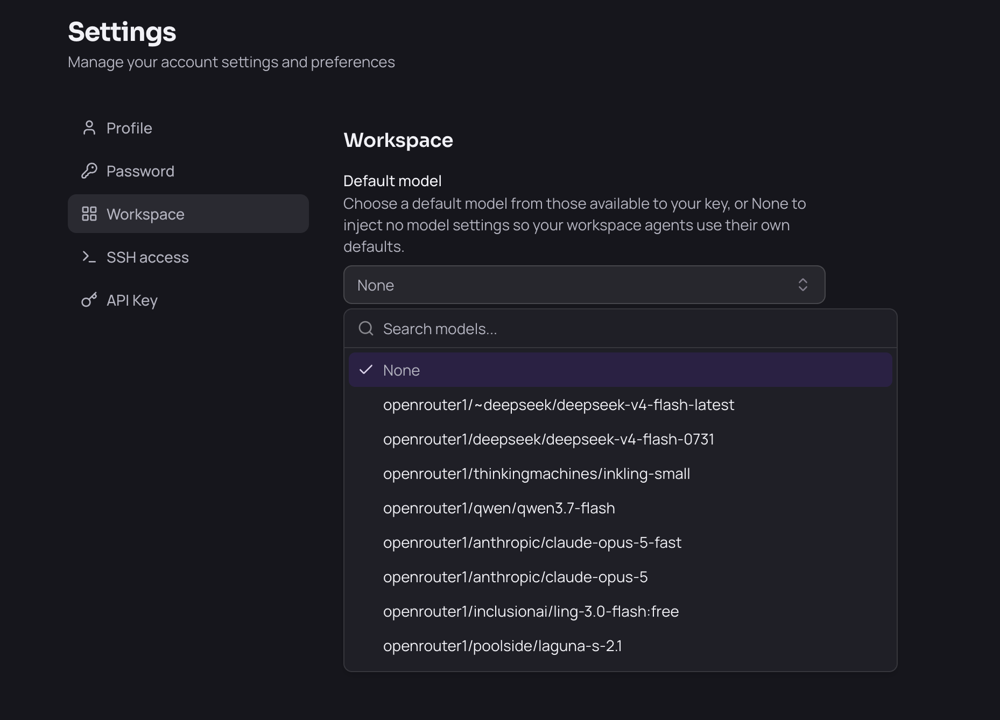
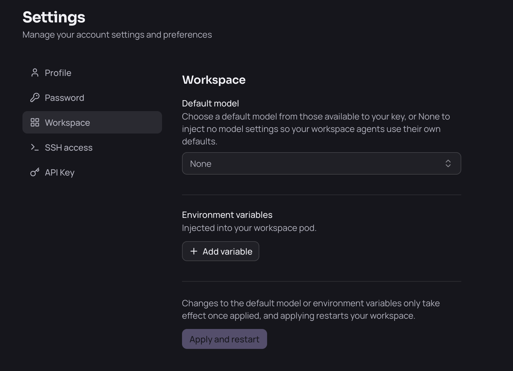

# Working with AI Agents

Your workspace ships eight AI coding agents, and you choose how they get their models. Pick a **default model** in your workspace settings and every agent is pointed at your organization's models automatically — nothing to paste, no account to sign into. Leave the default model unset and the agents keep their own sign-in, so you can use a personal subscription instead.

## The Agents

| Agent | What it is |
|---|---|
| **Claude Code** | Anthropic's agentic coding CLI |
| **OpenCode** | Open-source terminal coding agent |
| **Codex** | OpenAI's coding agent CLI |
| **Copilot CLI** | GitHub Copilot in the terminal |
| **Mistral Vibe** | Mistral's coding agent CLI |
| **Hermes** | Nous Research's agent |
| **OpenClaw** | Multi-model agent gateway and web UI |
| **Antigravity** | Google's terminal coding agent (`agy`) — see the exception below |

Seven of them run as terminal apps: open the tile in **Apps** and you land in the agent's CLI, ready for a prompt. **OpenClaw** is a web UI rather than a terminal.

You can also run the agents from a shell — open the **Terminal** app and run `claude`, `opencode`, `codex`, `copilot`, `vibe` or `hermes` directly. They read the same configuration.

## Using Your Organization's Models

Set a default model and every agent is configured against your organization's model gateway automatically:

1. Go to **Settings** → **Workspace**.
2. Under **Default model**, pick one of the models available to you.
3. Click **Apply and restart**.

Applying **restarts your workspace**, so save your work first. When it comes back, the agents are pointed at the gateway and authenticated with your key — you can start prompting straight away.

The models on offer are the ones your organization has enabled for your key. If the list is empty or fails to load, your gateway may still be starting; wait a moment and reload.

Within an agent you can usually switch models for a session using that agent's own model picker or `/model` command. The setting above is the default each agent starts from.

## Using Your Own Subscription Instead

If you have your own Claude, ChatGPT or other subscription, set **Default model** to **None**. Your workspace then injects no model settings at all, so each agent keeps its normal first-run behaviour — you sign in with your own account and your usage bills to your own subscription.

1. Go to **Settings** → **Workspace**.
2. Open **Default model** and choose **None**.
3. Click **Apply and restart**.

Two things to know:

- **None is the starting state.** A freshly installed workspace has no default model, so the agents are on their own sign-in until you choose one. You can switch between **None** and a platform model whenever you like; each change takes effect once the workspace restarts.
- **It is all-or-nothing.** The default model applies to every agent at once; you cannot put some agents on the platform's models and others on a personal subscription.

> **Note:** If your administrator changes the organization-wide default model, your workspace restarts and **your saved model choice is replaced by the new default**. This is deliberate — it is how a model that is being retired gets rolled off every workspace. Just pick your preferred model again afterwards.

## Your Configuration Edits Are Kept

Each agent's config file lives in your home directory, so it persists across restarts and you are free to edit it. Your workspace only rewrites the parts that point the agent at the gateway — the provider and endpoint settings — and leaves everything else you have set alone: your permissions, hooks, custom commands and other preferences all survive.

## Antigravity Is the Exception

**Antigravity (`agy`) cannot use your organization's models.** Google publishes no supported way to point the CLI at a custom endpoint or supply your own key, so it stays on Google's own sign-in. To use it, log in with a Google account when it prompts you.

This also means Antigravity's usage does not appear in your organization's model usage reporting at all, since its requests never reach the gateway.

## Usage Is Recorded

Requests the agents make through your organization's gateway are recorded and attributed to you and your workspace. Your administrator can see usage and cost per user — this is how model spend is tracked.

Coverage is not uniform:

- **Claude Code**, **Copilot CLI**, **Codex** and **OpenClaw** report detailed telemetry.
- **Mistral Vibe** and **OpenCode** do not export telemetry, though their requests still pass through the gateway.
- **Antigravity** is not covered at all, as described above.

> **Note:** Agent telemetry is set up independently of the model gateway, so it is still collected when you run on your **own subscription**. Your organization does not see your personal billing, but the agents you use in the workspace remain visible to your administrator.

## Troubleshooting

**An agent asks me to log in or for an API key.** That is expected if no **Default model** is set — the agents are on their own sign-in. To use your organization's models instead, pick a model in **Settings** → **Workspace** and click **Apply and restart**. If the model list is empty, your gateway may not be reachable yet; reload after a moment. Antigravity always asks for a Google login regardless.

**An agent reports a model that no longer exists.** Pick a current model in **Settings** → **Workspace** and click **Apply and restart**.

**An agent prompts me to trust the folder.** Accept it once; the choice is saved in your home directory and persists.

**I want to use my own Claude or ChatGPT subscription.** Set **Default model** to **None** in **Settings** → **Workspace**, click **Apply and restart**, then sign in to each agent with your own account. See [Using your own subscription instead](#using-your-own-subscription-instead).
