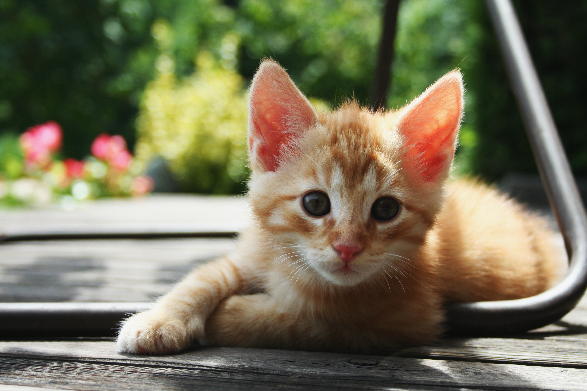

# Test Page

This is the second page of the documentation.

Go back to the [Introduction](index.md).

Until proper content comes, enjoy the company of this little kitty!



```python
print("Hello, World!")
```

Test print.
Test print.
2.0.0.2 version retag test 2
Test commit.
Test commit.